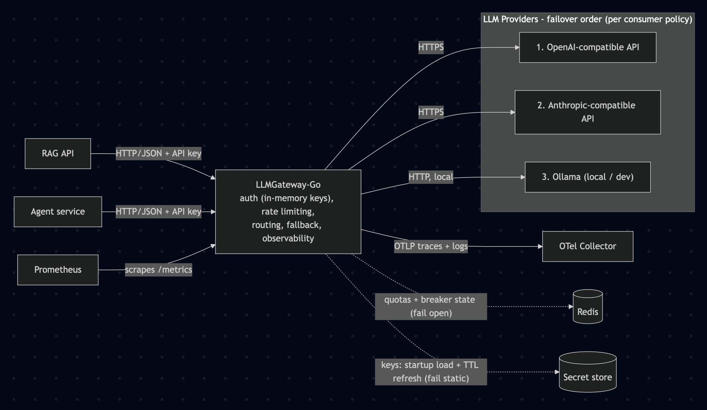

# LLMGateway-Go
One front door for every LLM. Unified API over OpenAI / Anthropic / Ollama
with per-app failover policies, rate + slot limiting, and full cost visibility.

## Why it's interesting 
- Failover is a contract: apps declare same-model / allowlist / any —
  the gateway never silently swaps models.
- Keys and quotas deliberately don't share a store — one Redis outage
  can't fail-closed the whole gateway.
- Slots (concurrency), not just rps, are rate-limited — a 2 rps agent
  can't starve a 40 rps API. 
- Every acceptance criterion is a runnable test: `make verify`.

## Adding an app
1. Generate a key and store it in the secret source: `...`
2. Add the app block to the gateway config (see config.example.yaml) —
   choose the failover policy deliberately; default is `same-model`,
   which today means no failover at all.
3. Roll the gateway (config applies on restart).
4. Verify: a request with the new key returns 200 and
   `llm_tokens_total{app="<name>"}` increments.
