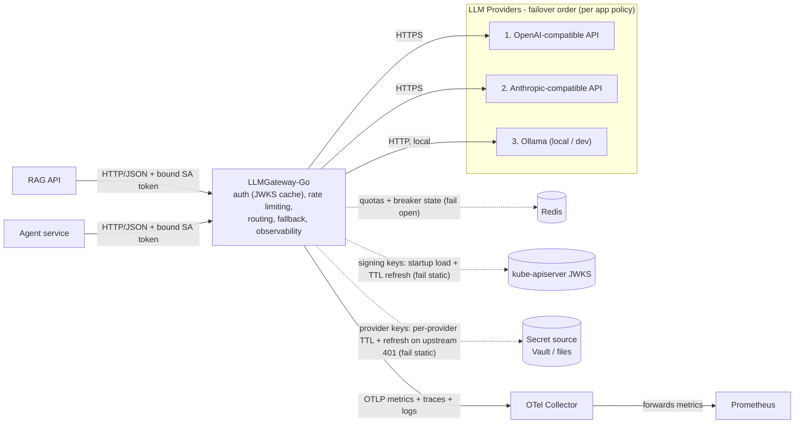
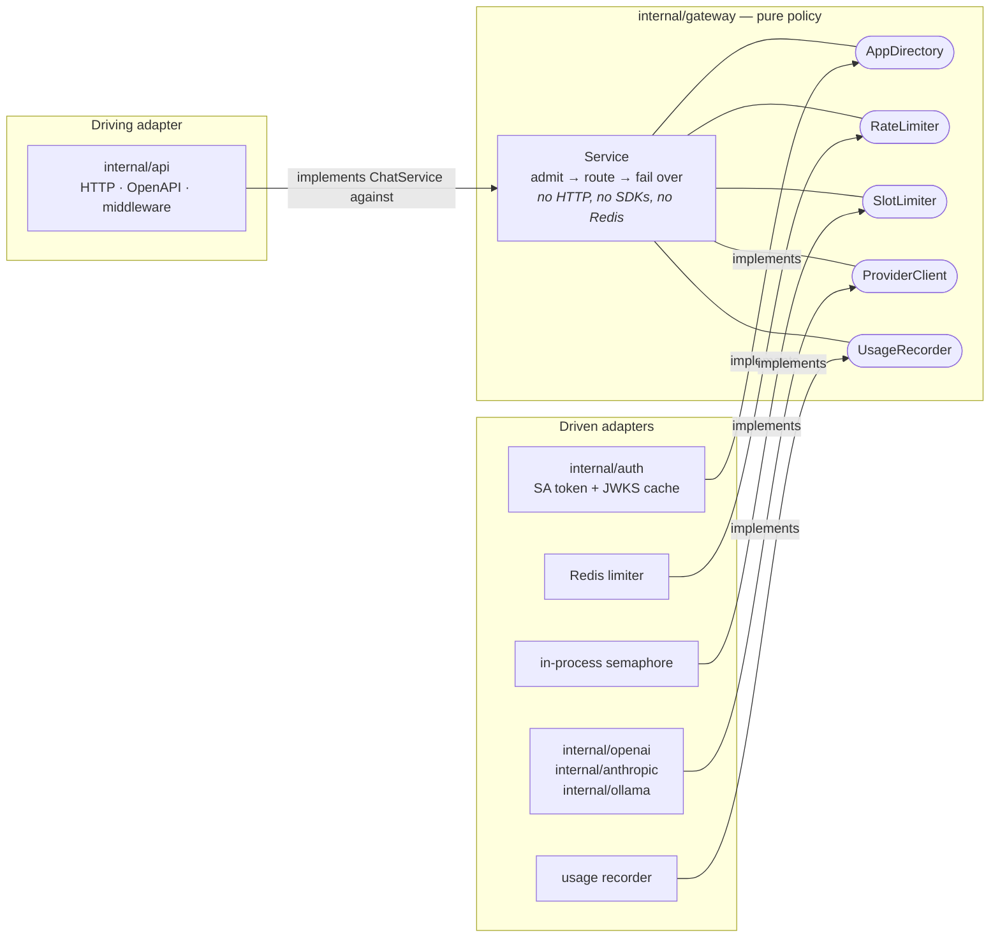

# LLMGateway-Go

One front door for every LLM. A unified API over OpenAI / Anthropic / Ollama
with per-app failover policies, rate + slot limiting, and full cost visibility.

## Tech stack

## What it solves

Every app that talks to an LLM rebuilds the same plumbing: one integration per
provider, API keys copy-pasted around, no shared limits, and no idea what
anything costs — until a provider has a bad day and takes the app down with it.

The gateway makes that one service's problem. Apps speak a single
OpenAI-compatible contract; the gateway translates per provider, holds every
credential, meters each app, and fails over under rules the app itself
declared. Adding a provider or swapping a model is a config change, not a
release.

## Why it's interesting

- **Failover is a contract, not a fallback.** Apps declare `same-model` /
  `allowlist` / `any`. The gateway never decides two models are
  interchangeable on an app's behalf, and the response always names the model
  that actually answered.
- **Keys and quotas deliberately don't share a store.** Auth fails *static*,
  rate limiting fails *open* — put them behind one Redis and a single outage
  triggers both policies, where fail-closed wins and the asymmetry becomes
  unreachable.
- **Slots are a currency, like rps and tokens.** A 2 rps agent holding 120 s
  calls occupies more concurrency than a 40 rps API. Meter only rates, and the
  slow app quietly starves the fast one.
- **Nothing fails invisibly.** Every degradation has a gauge, a log line, or a
  probe attached — serving a stale credential is only defensible because the
  staleness is measurable.
- **Every acceptance criterion is a runnable test.** `make verify`.

## Design - Hexagonal architecture.

`internal/gateway` holds the policy — admit, route, fail over — in domain
vocabulary, and declares the interfaces it needs. Everything technological
implements one of them from the outside, and every import points inward, so
swapping a provider, a transport, or the limiter never reaches the logic.
Cross-cutting concerns are decorators: same interface in, same interface out,
composed in `main` — which is why neither the core nor the adapters contain a
line of logging or metrics code.

Every arrow points *into* `internal/gateway`. Adapters import the core; the
core imports none of them, and cannot — the interfaces live in the package
that consumes them.

The reasoning behind the failure modes, the capacity math, and the decisions
they commit to lives in
[`docs/design/architecture-brief.md`](docs/design/architecture-brief.md).
