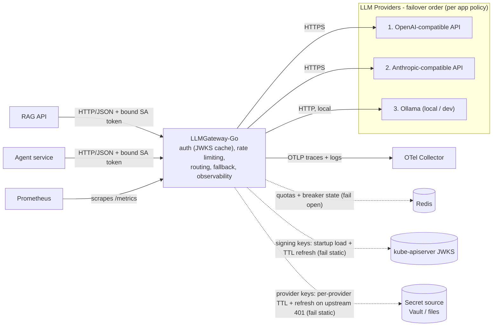

# LLMGateway-Go

One front door for every LLM. A unified API over OpenAI / Anthropic / Ollama
with per-app failover policies, rate + slot limiting, and full cost visibility.



## What it solves

Every app that talks to an LLM rebuilds the same plumbing: one integration per
provider, API keys copy-pasted around, no shared limits, and no idea what
anything costs — until a provider has a bad day and takes the app down with it.

The gateway makes that one service's problem. Apps speak a single
OpenAI-compatible contract; the gateway translates per provider, holds every
credential, meters each app, and fails over under rules the app itself
declared. Adding a provider or swapping a model is a config change, not a
release.

## Why it's interesting

- **Failover is a contract, not a fallback.** Apps declare `same-model` /
  `allowlist` / `any`. The gateway never decides two models are
  interchangeable on an app's behalf, and the response always names the model
  that actually answered.
- **Keys and quotas deliberately don't share a store.** Auth fails *static*,
  rate limiting fails *open* — put them behind one Redis and a single outage
  triggers both policies, where fail-closed wins and the asymmetry becomes
  unreachable.
- **Slots are a currency, like rps and tokens.** A 2 rps agent holding 120 s
  calls occupies more concurrency than a 40 rps API. Meter only rates, and the
  slow app quietly starves the fast one.
- **Nothing fails invisibly.** Every degradation has a gauge, a log line, or a
  probe attached — serving a stale credential is only defensible because the
  staleness is measurable.
- **Every acceptance criterion is a runnable test.** `make verify`.

## Design

**A hexagon.** `internal/gateway` is the core: admitting, routing, and failing
over completions, written in domain vocabulary with no HTTP, no SDKs, no
Redis. It declares five ports in the package that *consumes* them —
`AppDirectory`, `RateLimiter`, `SlotLimiter`, `ProviderClient`,
`UsageRecorder`. Adapters implement them and translate at the edges:
`internal/api` (HTTP), `internal/openai` · `anthropic` · `ollama` (providers),
`internal/auth` (ServiceAccount tokens verified against cached JWKS).
Dependencies point inward, always — adapters import the core, never the
reverse — so swapping a provider or a transport never reaches the logic.

**Decorators for everything cross-cutting.** No logging, metrics, or tracing is
written inline. Each lives in a package mirroring what it wraps —
`internal/logs/gateway`, `internal/metrics/api` — implementing the same port it
decorates and delegating through, with `main` composing the stack. The result:
observability is testable in isolation, and the core reads as pure policy
because it *is* pure policy.

The reasoning behind the failure modes, the capacity math, and the decisions
they commit to lives in
[`docs/design/architecture-brief.md`](docs/design/architecture-brief.md).

## Tech stack

Go 1.26, standard library only on the runtime path — `net/http`, `log/slog` for
structured logs, `context` for deadline propagation — with `gopkg.in/yaml.v3`
as the single dependency. Kubernetes for deployment: bound ServiceAccount
tokens for caller identity, verified locally against the cluster's JWKS rather
than a TokenReview on the request path. Provider credentials come from
HashiCorp Vault (or mounted files), one source per provider, each refreshed on
its own cadence. Redis holds quota and breaker state, OpenTelemetry carries
traces and logs, Prometheus scrapes the metrics, and the image is distroless.
The API is specified in [`openapi.yaml`](openapi.yaml), linted as a fixture and
fuzzed against a running gateway by contract tests.

## Run it

```bash
make run                  # against config/config.yaml — copy config.example.yaml
make verify               # what CI runs: spec lint + tests
make docker-build         # the exact image Kubernetes schedules
kubectl apply -f deploy/  # namespace, RBAC, config, deployment, service
```

`config.example.yaml` is the executable schema — a test parses and validates it
on every run, so it cannot drift from the code.

## Adding an app

1. **Give it an identity.** Create its ServiceAccount (`deploy/callers.yaml`)
   and have the kubelet project a bound token into its pod with
   `audience: llm-gateway`. No key is issued — the token *is* the credential,
   short-lived and audience-bound.
2. **Add its block to the config**: subject, its three limits (rps, tokens,
   slots), and its failover policy. Choose that policy deliberately — the
   default `same-model` means no failover at all until a second route serves
   the same model.
3. **Roll the gateway** — config applies at startup.
4. **Verify**: a request bearing the projected token returns 200, and
   `llm_tokens_total{app="<name>"}` increments.
