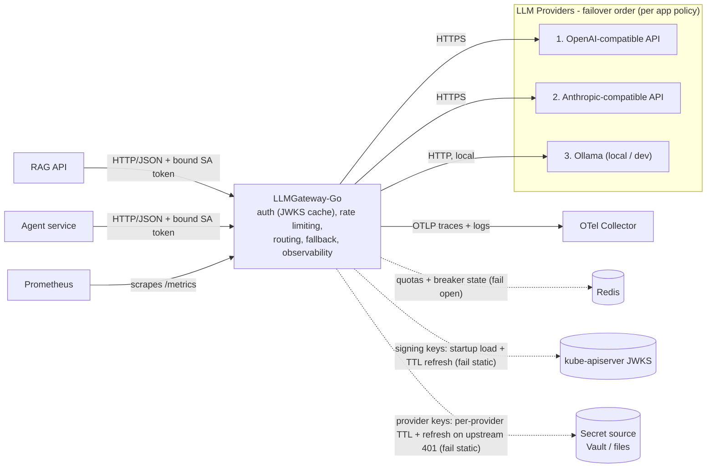
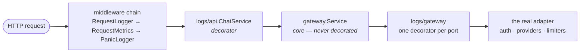

# LLMGateway-Go

One front door for every LLM. A unified API over OpenAI / Anthropic / Ollama
with per-app failover policies, rate + slot limiting, and full cost visibility.

## Tech stack




## What it solves

Every app that talks to an LLM rebuilds the same plumbing: one integration per
provider, API keys copy-pasted around, no shared limits, and no idea what
anything costs — until a provider has a bad day and takes the app down with it.

The gateway makes that one service's problem. Apps speak a single
OpenAI-compatible contract; the gateway translates per provider, holds every
credential, meters each app, and fails over under rules the app itself
declared. Adding a provider or swapping a model is a config change, not a
release.

## Why it's interesting

- **Failover is a contract, not a fallback.** Apps declare `same-model` /
  `allowlist` / `any`. The gateway never decides two models are
  interchangeable on an app's behalf, and the response always names the model
  that actually answered.
- **Keys and quotas deliberately don't share a store.** Auth fails *static*,
  rate limiting fails *open* — put them behind one Redis and a single outage
  triggers both policies, where fail-closed wins and the asymmetry becomes
  unreachable.
- **Slots are a currency, like rps and tokens.** A 2 rps agent holding 120 s
  calls occupies more concurrency than a 40 rps API. Meter only rates, and the
  slow app quietly starves the fast one.
- **Nothing fails invisibly.** Every degradation has a gauge, a log line, or a
  probe attached — serving a stale credential is only defensible because the
  staleness is measurable.
- **Every acceptance criterion is a runnable test.** `make verify`.

## Design

`internal/gateway` holds the policy — admit, route, fail over — in domain
vocabulary, and declares the interfaces it needs. Everything technological
implements one of them from the outside, and every import points inward, so
swapping a provider, a transport, or the limiter never reaches the logic.
Cross-cutting concerns are decorators: same interface in, same interface out,
composed in `main` — which is why neither the core nor the adapters contain a
line of logging or metrics code.


Every arrow points *into* `internal/gateway`. Adapters import the core; the
core imports none of them, and cannot — the interfaces live in the package
that consumes them.



<details>
<summary>Detailed explanation</summary>

**A hexagon architecture.** `internal/gateway` is the core: admitting, routing, and failing
over completions, written in domain vocabulary with no HTTP, no SDKs, no
Redis. It declares five ports in the package that *consumes* them —
`AppDirectory`, `RateLimiter`, `SlotLimiter`, `ProviderClient`,
`UsageRecorder`. Adapters implement them and translate at the edges:
`internal/api` (HTTP), `internal/openai` · `anthropic` · `ollama` (providers),
`internal/auth` (ServiceAccount tokens verified against cached JWKS).
Dependencies point inward, always — adapters import the core, never the
reverse — so swapping a provider or a transport never reaches the logic.

**Decorators for everything cross-cutting.** No logging, metrics, or tracing is
written inline. Each lives in a package mirroring what it wraps —
`internal/logs/gateway`, `internal/metrics/api` — implementing the same port it
decorates and delegating through, with `main` composing the stack. The result:
observability is testable in isolation, and the core reads as pure business.

</details>

The reasoning behind the failure modes, the capacity math, and the decisions
they commit to lives in
[`docs/design/architecture-brief.md`](docs/design/architecture-brief.md).

## Run it

Three paths, cheapest first. Each exercises strictly more than the one above
it, so start at the top and only go down when you need what it adds.

**1 · Bare binary** — config load, the HTTP edge, auth rejection. Needs Go.

```bash
cp config.example.yaml config/config.yaml   # your local copy; config/ is gitignored
make run                                     # serves :8080, Ctrl-C drains in-flight requests
```

```bash
curl -s localhost:8080/healthz               # {"status":"ok"} — liveness, unconditional
curl -s localhost:8080/readyz                # 200 once signing keys and provider keys have loaded
curl -s -X POST localhost:8080/v1/chat \
  -H "Authorization: Bearer $TOKEN" \
  -H 'Content-Type: application/json' \
  -d '{"model":"gpt-4.1","max_tokens":64,"messages":[{"role":"user","content":"hi"}]}'
```

The response's `model` field names whichever model actually served the
request, and `X-Model-Substituted: true` appears if that wasn't the one you
asked for. `X-Correlation-ID` comes back on every response — send your own to
thread it through logs, metrics, and traces.

**2 · Container** — the shipped image, nonroot, SIGTERM drain. Needs Docker.

```bash
make docker-build                            # gcr.io/distroless/static:nonroot
make docker-run                              # mounts ./config read-only on :8080
make docker-stop                             # SIGTERM, so you can watch it drain
```

**3 · Kubernetes** — ServiceAccount identity, probes, the real thing.

```bash
kubectl apply -f deploy/                     # namespace, RBAC, SAs, config, deployment, service
kubectl -n llm rollout status deploy/llm-gateway
kubectl -n llm port-forward svc/llm-gateway 8080:80
```

Config lives in the `llm-gateway-config` ConfigMap and is read at startup, so
a config change means `kubectl rollout restart deploy/llm-gateway`.

**Checks**

```bash
make verify                                  # what CI runs: OpenAPI lint + all tests
make test-race                               # the same tests under the race detector
make cover                                   # coverage.out + annotated coverage.html
make contract-test                           # fuzz a running gateway against openapi.yaml
```

`config.example.yaml` is the executable schema — a test parses and validates it
on every run, so it cannot drift from the code. `docs/local-testing.md` walks
the same three paths in more depth, including what each failure mode looks like.

## Adding an app

No key is ever issued. An app's identity is its Kubernetes ServiceAccount, and
its credential is the short-lived, audience-bound token the kubelet projects
into its pod — so onboarding is three config edits and a rollout.

**1 · Create the ServiceAccount** the app will run as (`deploy/callers.yaml`):

```yaml
apiVersion: v1
kind: ServiceAccount
metadata:
  name: my-app
  namespace: llm
```

**2 · Declare it in the gateway config** — its subject, its three limits, and
its failover policy:

```yaml
apps:
  my-app:
    subject: system:serviceaccount:llm:my-app   # must match the SA exactly
    total_deadline: 30s                         # optional; override for long tool-calling runs
    limits:
      rps: 20                                   # requests per second
      tokens_per_minute: 100000                 # token budget per minute
      max_in_flight: 100                        # concurrent slots; must fit under global_max_in_flight
    failover_policy: any                        # any | same-model | {allowlist: [...]}
```

Choose the policy deliberately — it's a contract term, not a tuning knob.
`any` takes whatever `failover_order` offers; `same-model` refuses every
substitute, which today means **no failover at all** until a second route
serves that model; `{allowlist: [gpt-4.1, claude-sonnet-4]}` names acceptable
substitutes in preference order, and every entry must exist in `routes`.
Omitting the field means `same-model` — substitution is opt-in, never assumed.

**3 · Project the token** in the calling app's own pod spec. The `audience`
must match the gateway's `auth.audience`, or verification fails closed:

```yaml
serviceAccountName: my-app
volumes:
  - name: gateway-token
    projected:
      sources:
        - serviceAccountToken:
            path: token
            audience: llm-gateway
            expirationSeconds: 3600
```

The app then reads that file and sends it as `Authorization: Bearer <token>`.
Re-read it per request — the kubelet rotates it in place.

**4 · Roll the gateway** so it picks up the new app block:

```bash
kubectl -n llm rollout restart deploy/llm-gateway
kubectl -n llm rollout status deploy/llm-gateway
```

**5 · Verify** — mint a token by hand and call through:

```bash
TOKEN=$(kubectl create token my-app -n llm --audience=llm-gateway)
curl -s -D- -X POST localhost:8080/v1/chat \
  -H "Authorization: Bearer $TOKEN" -H 'Content-Type: application/json' \
  -d '{"model":"gpt-4.1","max_tokens":32,"messages":[{"role":"user","content":"ping"}]}'
```

A 200 whose `model` field names a real model means identity, limits, and
routing all resolved. Then confirm the app is being metered on its own
account: `llm_tokens_total{app="my-app"}` on `/metrics` should increment.

Common refusals, and what each one means:

| Response | Cause |
|---|---|
| `401` | Token missing, expired, wrong audience, wrong issuer, or its `subject` doesn't match any app block |
| `429` + `Retry-After` | The app hit its own rps/token quota, or its `max_in_flight` ceiling |
| `503 model_unavailable` | Policy left no eligible route — the expected answer for `same-model` during an outage |
| `502` | Every policy-eligible provider failed |
