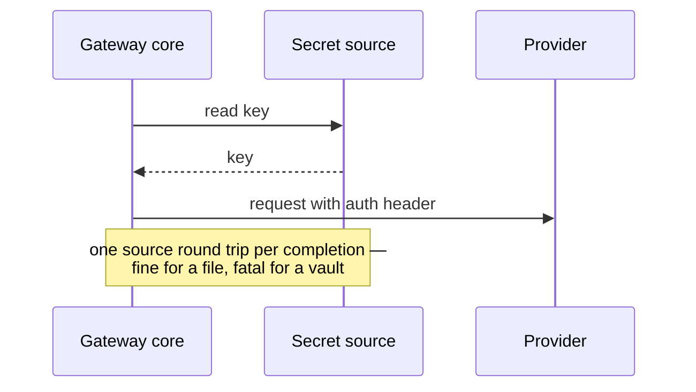
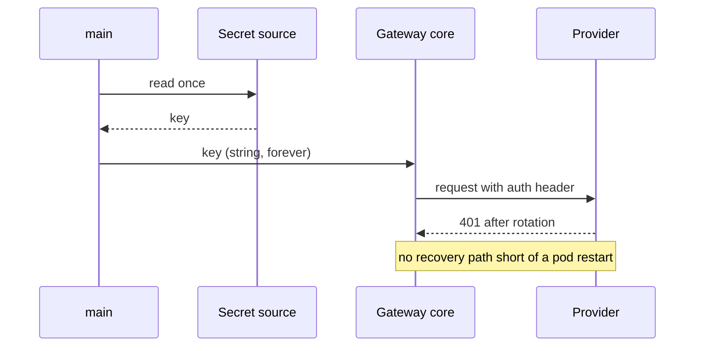
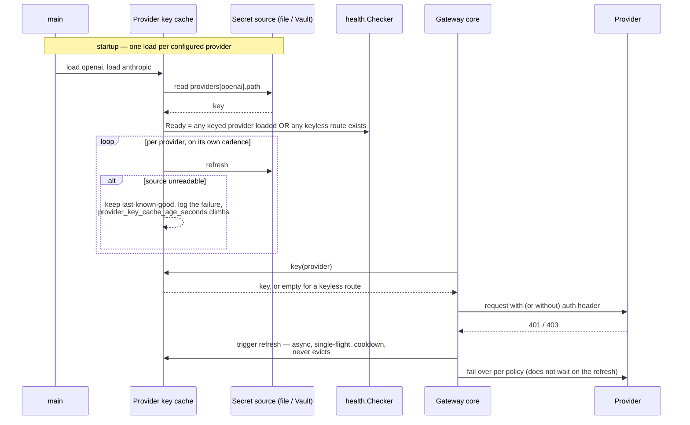

# ADR-001: Provider API keys load into an in-memory cache from one source per provider, each refreshed on its own TTL, failing static on refresh failure and refreshing out of band when a provider rejects a key

| | |
|---|---|
| **Subject** | Where outbound provider credentials come from, how they reach each adapter, and what happens when a source is down or a provider rejects a key |
| **Status** | Accepted (proposed 2026-07-24, accepted 2026-07-26, decider: Fernando Fragateiro) |
| **Ticket** | — (predates the ticket list; `internal/providerkeys` implements it, GW-103 records its metrics) |
| **Parent** | Architecture brief — design decision #1 (provider key cache: startup load + TTL refresh, fail static) and #8 (out-of-band refresh on upstream rejection) |
| **Related** | `auth.JWKSCache` + `logs/auth.JWKSRefresher` (the pattern this mirrors), `TODO.md` step 4, ADR-003 (unrelated currency, same fail-open family) |
| **Start date** | 2026-07-24 |
| **End date** | 2026-07-26 |

## Purpose

This document is the source of truth for provider credential sourcing: one in-memory cache keyed by provider name, one source per provider, per-provider cadences, fail static, and an out-of-band refresh triggered by upstream rejection. It shapes `main.go`'s wiring, the adapters' constructor signatures, and the `provider-keys` readiness gate.

**Frozen** per `ADR-STRUCTURE.md`: if any of this changes, it changes in a new ADR marked `Supersedes: ADR-001`, not by editing this file. The title grew on acceptance — per-provider sourcing and the out-of-band refresh were decided after the original one-line framing was written, and a title that omits them would misstate what was accepted.

*Restructured 2026-08-04 into the current `ADR-STRUCTURE.md` template. Format only — no decision, consequence, or resolved question was changed, added, or dropped.*

## Scope

**In scope**

- Where provider API keys come from (`kind: file`, `kind: vault`), and how the right one — or none — reaches each of `internal/openai`, `internal/anthropic`, `internal/ollama`.
- The cache's identity (keyed by provider name), its refresh cadences, and its behavior when a source is unreadable.
- The readiness gate the cache registers, and the staleness gauge that makes fail-static defensible.
- The "refresh now" path decision #8 requires, and the four constraints that come with it.
- The concrete vault and how the gateway authenticates to it.

**Out of scope**

- Inbound caller authentication. That is `auth.JWKSCache`'s job; the two "share a pattern, never a failure domain," and this cache is read only when the gateway calls *out*.
- Mapping a provider 401/403 onto a failover. That is the core's job — it constrains nothing here except that the cache must expose the trigger without knowing why it fired.
- Anything in Redis. Quota and breaker counters live there; keys do not, deliberately.

## Decision Drivers

- **The adapters take a plain string today, and nothing constructs it.** `NewOpenAI(client, apiKey string)` / `NewAnthropic(client, apiKey string)` were scaffolding to get the providers implemented, not a design. Nothing wires them in `cmd/gateway/main.go` yet.
- **`SecretSource` exists and is entirely unread.** `Kind`, `Path`, and `RefreshInterval` are all unused. `RefreshInterval` existing at all is a strong hint the intended design is a periodically-refreshed cache, not a read-once-at-boot value.
- **A vault read is a network call.** `TODO.md` step 4 solved this shape of problem once, with `auth.NewFetchClient` re-reading the ServiceAccount token file per request — cheap, because the kubelet projects it to local disk. Provider keys are different: `Kind` can be `"vault"`, so re-reading per request would put a vault round trip on every single chat completion.
- **"Needs a key" is a property of the endpoint, not the provider name.** `internal/ollama` sends `Authorization: Bearer <key>` when the key is non-empty (Ollama Cloud) and no auth header at all when it is empty (in-cluster, a trusted network address needing no credential). Config can declare two routes with the same `Provider` value and different `Endpoint`s, so a design that decides "needs a key" purely from the provider name cannot express a deployment running both.
- **The brief already committed the policy.** Design decision #1 names this cache directly — startup load, TTL refresh, fail static. This ADR builds that cache; it does not get to choose the policy.
- **No shared failure domain with auth or Redis.** The *Redis down* failure row depends on "neither key cache lives in Redis by design, so no shared fate with auth", so the loader must not acquire a Redis dependency to stay correct.
- **A partial fault must degrade routing, not ground the pod.** Replicas share a secret source, so failing closed on one provider's dead source leaves no healthy instance to shed to — and an all-self-hosted deployment must pass readiness with zero secrets configured.
- **Fail-static is only acceptable if staleness is visible.** The *Stale provider key cache* row commits to a `provider_key_cache_age_seconds{provider}` gauge and an alert; with per-provider cadences an unlabelled gauge could not express "OpenAI is stale, Anthropic is fine".

## Options Considered

### Option 1 — Read the key fresh on every request

**Description:** Mirror `auth.NewFetchClient` exactly — no cache, no refresh loop, no readiness gate. Each outbound call reads the secret at the moment it needs it.

**Contract:** a fetch function called on the request path; `SecretSource.RefreshInterval` becomes meaningless and would be deleted.

**Pros:**
- Simplest possible design — nothing to keep warm, nothing to gate readiness on, no staleness to observe.
- Zero revocation latency: the next request after a rotation already uses the new key.
- Already proven in this codebase for the ServiceAccount token.

**Cons:**
- Fine for `Kind: "file"`, fatal for `Kind: "vault"`: it puts a network round trip on every completion request. The design has to work for both `Kind` values the config already declares.
- Makes the secret store a hard request-path dependency, which is the shared-fate problem the brief spends decision #1 avoiding.

### Option 2 — Load once at boot, never refresh

**Description:** Read `SecretSource.Path` at startup, keep the string in memory, done. Closest to what exists today.

**Contract:** one read in `main.go`; `RefreshInterval` unused.

**Pros:**
- No refresh loop, no goroutine lifecycle, no cooldown state — the smallest amount of new code of any option.
- No load on the secret source beyond boot.

**Cons:**
- This is the exact stale-secret bug `TODO.md` step 4 exists to kill, just moved to a different secret. A rotated or revoked provider key means every completion 401s from the provider until someone restarts the pod, with no warning beforehand.
- Nothing to observe: there is no staleness gauge that means anything when the value never changes.

### Option 3 — In-memory cache, per-provider sources and cadences, fail static, out-of-band refresh — chosen

**Description:** Mirror `auth.JWKSCache` + `logs/auth.JWKSRefresher`. Load at boot; a background loop per provider refreshes on that provider's configured interval; a failed refresh logs a warning and keeps serving last-known-good instead of going cold; `Ready()` wires into `health.Checker` so a pod with nothing servable stays not-ready. A provider with no configured secret simply has nothing in the cache, and the adapter sends no auth header — today's Ollama behavior, made explicit instead of hardcoded. A provider rejecting the key triggers a refresh out of band rather than waiting out the interval.

**Contract:** `SecretSource` stops being one `Path` + one `RefreshInterval` and gains a `providers` map; the cache is keyed by provider name; the refresher exposes a "refresh now" path alongside its ticker.

**Pros:**
- Reuses a pattern already proven in this codebase — same shape of tests (spec-style, temp dir standing in for the mount), same fail-closed-at-cold-start / fail-static-once-warm behavior callers already trust for JWKS. Naming stays parallel and unambiguous: two caches, two readiness checks (`jwks`, `provider-keys`), two staleness gauges (`jwks_cache_age_seconds`, `provider_key_cache_age_seconds`), two decorators — a reader never has to guess which cache a log line or a refused readiness check came from.
- No vault round trip on the request hot path.
- One shared loading path instead of each provider package inventing its own — avoids the providers silently disagreeing on file vs. vault behavior.
- Makes "does this provider need a key" an explicit, data-driven fact (a secret is configured, or it isn't) instead of the hardcoded assumption `internal/ollama` has today, so a self-hosted-to-cloud Ollama migration is a config change, not a code change.
- Per-provider sourcing keeps blast radius at one provider. A mangled secret, an unreachable path, or a botched rotation costs exactly the provider it belongs to; the others neither notice nor go stale, and failover covers the gap. A shared source would have made every single-provider mistake a whole-gateway mistake.
- Both kinds land on their native shape. `kind: file` points each entry at its own file, which is precisely what a Kubernetes Secret volume produces — one file per data key — with the filename in config instead of an undocumented convention. `kind: vault` points each entry at its own path, which is how vault secrets are actually organized. Neither backend is being bent to fit the other.
- Sourcing fans out, but nothing else does: one cache, one lookup, one readiness check, one decorator pattern. `Kind` still picks a fetcher, not a second design.

**Cons:**
- N fetches and N timers where there was one, plus N cooldown states for decision #8's trigger.
- No coherent snapshot — two providers' keys can be of different vintages.
- More moving parts than the placeholder: a new secret-cache type, a per-provider refresh loop wired into `main.go`, a config schema change, and a new readiness check.
- Shipping `kind: vault` in the MVP roughly doubles the surface.

*(Each of these is expanded, with its mitigation, under **Known limitations** below.)*

## Flow Representation

**Option 1 — read per request**



**Option 2 — load once at boot**



**Option 3 — per-provider cache, fail static, out-of-band trigger (chosen)**



## Important Notes

- The config shape this decides, and the reason it is not one `Path`:

  ```yaml
  secret_source:
    kind: vault
    refresh_interval: 5m            # default for entries that omit it
    providers:
      openai:
        path: secret/llm/openai
        refresh_interval: 1m        # rotates hourly upstream — chase it
      anthropic:
        path: secret/llm/anthropic  # inherits 5m
      # ollama absent — self-hosted, no key, nothing to fetch
  ```

  A single shared file can only be re-read at the shortest configured interval, which makes every other provider's cadence decorative. Independent cadences require independent sources.

- **Each source holds exactly one key**, so there is no map to decode and no file format to agree on. For `kind: file` the value is the file's bytes, trimmed. For `kind: vault` a path yields a structured secret, so one field name is fixed by convention: `key`.
- **`providers[].path` is the literal API path read, `data/` segment included** (`secret/data/llm/openai` for a KV v2 mount). The alternative — logical paths plus client-side rewriting — hides a mount-version assumption in code, where a wrong guess produces a confusing 404 instead of an operator-visible path.
- **The Vault token has its own lifecycle.** It leases and expires, so the client renews it and re-authenticates when renewal fails. That is a second refresh loop, unrelated to the per-provider key cadences, and it is new failure surface the file kind does not have.
- `gateway.ModelProvider` (the routes list) deliberately carries only `Model`/`Provider`/`Endpoint` — no secret. Keying the cache anywhere else would introduce a second identity the architecture does not have.
- `config.example.yaml`'s whole `secret_source` block has to be rewritten, not just its `path`. That file is a CI-parsed fixture, so the change lands with the config schema, not before.

## Open Questions — all resolved

Kept as a record rather than deleted: two of these reversed an earlier answer, and the reasoning that forced the reversal is the part worth reading. Resolved 2026-07-26; nothing here is outstanding.

1. ~~**One cache for all providers, or one per provider?**~~ **Resolved (2026-07-26) — one cache, one source per provider. See Decision.** This answer was reversed once. It first read "one file holding every key," which was coherent until Question 5 landed on per-provider refresh cadences — and a single file can only be re-read at the shortest configured interval, which makes every other provider's cadence decorative. Independent cadences require independent sources, so `SecretSource` gains a `providers` map of path + interval. The cache stays single and provider-keyed; only the *sourcing* fans out. Rejected alternative: one file plus a per-provider filter on read — keeps one fetch, but the fetch is the thing being scheduled, so it does not deliver independent cadences at all.
2. ~~**What encoding does that one file use?**~~ **Dissolved (2026-07-26) — see Decision.** With one source per provider, each source holds exactly one key: nothing to encode, no map to parse, no format to agree on. For `kind: file` the value is the file's bytes, trimmed; the earlier YAML-vs-env-lines debate had no subject left once the file stopped holding more than one thing. One remnant survives for `kind: vault`, where a path yields a structured secret and one field name must be fixed by convention — `key` unless the chosen vault forces otherwise. Consequence unchanged: `config.example.yaml`'s `secret_source` block must be rewritten, `path: /etc/gateway/keys` included.
3. ~~**Does `Kind: "vault"` need to work for MVP, or is it a placeholder?**~~ **Resolved (2026-07-26) — it ships working in the MVP.** Both kinds are built and tested at launch; neither is a stub, so the "clear not-implemented boot error" this question asked for is moot. Two things follow. First, the per-provider sourcing above is not speculative generality — one vault path per secret is how vaults are actually used, so `providers[].path` is the native shape rather than a concession. Second, the *Revisit when* line that deferred the vault choice to a follow-up ADR no longer applies: choosing the concrete vault is now in scope for this one, which is Question 7.
4. ~~**Is fail-static acceptable for a *rejected* key, not just a *down* secret store?**~~ **Resolved (2026-07-26) — by the brief, see Decision.** The gap this question named has been closed at the source: the Failure Modes table now carries a *Provider rejects the gateway's own key (401/403)* row, classified **provider-scoped**, and design decision #8 states the policy. Fail-static still holds for the *cache* — a rejection never evicts the cached key, because sending no credential is worse than sending a stale one — but the rejection is treated as evidence the cache is stale and **triggers an out-of-band refresh** rather than waiting out `RefreshInterval`. That is what this ADR must build; the constraints it imposes are in the Decision.
5. ~~**Same refresh interval for every provider, or independent?**~~ **Resolved (2026-07-26) — independent, one cadence per provider.** Each `providers` entry carries its own `refresh_interval`, inheriting the block-level value when it omits one. This is the answer that forced Question 1's reversal: cadence and sourcing cannot be decided separately, because a shared source can only be scheduled once. Cost, accepted: N timers and N fetches where there was one, and no single coherent snapshot — two providers' keys can be of different vintages. That costs nothing here, because provider keys are independent credentials with no cross-provider invariant to violate.
6. ~~**Is "needs a key" keyed by provider name, or by route?**~~ **Resolved (2026-07-26) — by the brief, see Decision.** Provider name. The brief has exactly one provider identity: `routes[].provider` and `failover_order: [openai, anthropic, ollama]`. Keying the secret cache by `Endpoint` or a per-route secret reference would add a second identity nothing else in the architecture uses, and failover — which the brief specifies in provider-name terms — would then key on one thing while credentials key on another. Consequence, accepted: a deployment mixing self-hosted and cloud Ollama needs two distinct provider names in config (`ollama` and `ollama-cloud`) plus two entries in `failover_order` to disambiguate. That is a config convention, not a code change, and the brief's diagram shows one Ollama deployment mode anyway (`Ollama (local / dev)`).
7. ~~**Which vault, and how does the gateway authenticate to it?**~~ **Resolved (2026-07-26) — HashiCorp Vault, Kubernetes auth method.** The gateway already presents a bound ServiceAccount token to reach the JWKS endpoint (`auth.NewFetchClient`), and Vault's Kubernetes auth method trades exactly that token for a Vault token: no new credential to distribute, and no chicken-and-egg where reading secrets needs a secret. Rejected: a cloud secrets manager (AWS/GCP), less operational work wherever workload identity already exists — but this cluster is Docker Desktop, where it doesn't, and adopting one would mean managing cloud IAM to serve a local cluster. Three things follow, all visible in `config.example.yaml`, and all recorded under **Important Notes**: the Vault token's own lifecycle, `providers[].path` being the literal API path, and the `key` field convention closing Question 2's remnant.

## Summary

All three options agree that the plain-string constructor is scaffolding and that something must own sourcing. They differ on when the read happens: Option 1 reads per request and cannot survive `kind: vault`; Option 2 reads once and reintroduces the stale-secret bug `TODO.md` step 4 exists to kill; Option 3 reads on a schedule and pays for it with refresh machinery.

Common to all of them: a provider with no configured secret must remain a valid steady state, because in-cluster Ollama needs no credential, and any design that treats a missing entry as a boot error breaks the one provider that is supposed to need nothing.

**Recommendation: Option 3.** It is the only one that fits `Kind: "vault"` without a per-request network call, and it does not reintroduce the stale-secret bug Option 2 has.

## Decision

Provider keys load into **one in-memory cache for the whole gateway, keyed by provider name**, fed by **one source per provider**, each loaded at startup and refreshed on its own cadence, failing static on a failed refresh.

**Rules that follow — from the brief, not this ADR's invention:**

- **In memory, startup load + TTL refresh, fail static.** Design decision #1 names this cache directly: it holds outbound credentials from `secret_source`, refreshed on its own TTL, failing static. This ADR builds that cache; it does not choose the policy.
- **It authenticates nobody.** Inbound identity is the JWKS cache's job, and the two "share a pattern, never a failure domain." This cache is read only when the gateway calls *out*, never on the caller-auth path, and no request is ever rejected because of its state. In code the two are `auth.JWKSCache` and a separate provider key cache; the brief's old single "key cache" no longer exists in either place.
- **No Redis, no shared failure domain.** Quota and breaker counters live in Redis, keys do not. The *Redis down* failure row depends on this, so the loader must not acquire a Redis dependency to stay correct.
- **Its own readiness check, gated on "at least one servable route".** `Ready` reports true once any keyed provider's source has loaded or any keyless route exists, and false only when nothing is servable. Registered on `health.Checker` as `provider-keys`, alongside `jwks`.
- **Staleness is observable, per provider** — `provider_key_cache_age_seconds{provider}` plus an alert on staleness age. Per the project's decorator rule the gauge lives in a metrics decorator around the refresher, not inside the cache, mirroring how `logs/auth.JWKSRefresher` already wraps the JWKS refresh.
- **Keyed by provider name.** The brief's routing vocabulary has exactly one provider identity. Keying the secret cache on anything else would introduce a second identity the architecture doesn't have. (Closes Question 6.)
- **A missing entry is a valid steady state.** A provider absent from the source has no key: the lookup returns empty, the adapter sends no auth header, nothing fails. Boot fails only when the source itself cannot be read or parsed.
- **Never logged.** The decorator logs the *refresh failure*, never the value.
- **The TTL is not the only refresh trigger.** Decision #8 and the *Provider rejects the gateway's own key (401/403)* row require an out-of-band refresh on upstream rejection, so the cache exposes a "refresh now" path alongside its ticker. Four constraints come with it, all from the brief: the trigger is **asynchronous** (the rejected request fails over immediately and never waits on a secret-source read); **at most one refresh is in flight per source, behind a cooldown**, so a permanently-rejected key cannot turn request rate into Vault load; a rejection **never evicts** the cached key; and the trigger is counted as `provider_key_refresh_triggered_total{provider}`, which is what separates a rotation healing itself from a misconfiguration looping forever.
- **Adding a provider stays a config change** — a new route plus a new entry in the secret source, no gateway rebuild.

**Rules that follow — not derived from the brief.** The brief is silent on the secret source's internal layout, so these are this ADR's own choices and should be read as weaker than the clauses above:

- **One source per provider, each with its own path and cadence.** `SecretSource` gains a `providers` map; the top-level `refresh_interval` becomes the default each entry may override, so the common case stays one line. This is what makes Question 5's per-provider cadence real rather than decorative.
- **Each source holds exactly one key**, so Question 2 dissolves rather than gets answered.
- **A provider absent from `providers` has no key.** Absence is the config-level expression of "this route needs no credential", which is exactly what in-cluster Ollama is.
- **Fetches, timers, refreshes, gauges, and cooldowns are all per-provider.** One provider's failing source never delays, empties, or invalidates another's — they share code, not fate.

**Known limitations:**

- **N fetches and N timers where there was one**, plus N cooldown states. Under `kind: vault` that is N round trips per cycle against the vault instead of one, and each entry is one more thing to misconfigure. **Mitigation:** a wrong path fails only its own provider — the upside of the same coin — but it fails quietly until the gauge or a 401 says so, which is why the per-provider gauge is load-bearing rather than decorative.
- **No coherent snapshot.** Two providers' keys can be of different vintages and there is no instant where the set is known-consistent. **Mitigation:** none needed today — provider credentials share no invariant — but it forecloses any future design that needs them versioned together, which is a revisit trigger below.
- **`config.example.yaml`'s whole `secret_source` block has to be rewritten**, not just its `path`. **Mitigation:** that file is a CI-parsed fixture, so the change lands with the config schema, not before.
- **Readiness got subtler.** "At least one servable route" is a weaker, more conditional gate than "the cache loaded", and it has to reason about keyless routes to avoid grounding an all-Ollama deployment. **Mitigation:** none structural — it is easy to implement as "any key present" by accident, which would break exactly that deployment, so the all-Ollama case needs an explicit test.
- **Revocation latency splits in two, and only one half improved.** A key the provider *rejects* recovers in one out-of-band refresh, not a full interval. A key that has leaked but is still *accepted* is unaffected: nothing rejects it, so nothing triggers, and it stays usable for up to one `RefreshInterval`. **Mitigation:** none — the same tradeoff already accepted for JWKS keys. The trigger fixes rotation damage, not leaks.
- **The out-of-band trigger is the fiddliest part of this design.** Single flight plus a cooldown is real concurrency code with its own failure mode — a refresh that hangs holds the single-flight slot and silences further triggers. **Mitigation:** the fetch needs its own timeout, independent of `RefreshInterval`. Getting the guard wrong in the other direction is worse: an unguarded trigger converts one revoked key into request-rate load against Vault.
- **More moving parts than the placeholder:** a new secret-cache type, a per-provider refresh loop wired into `main.go` (goroutines + `ctx` lifecycle, like `refreshJWKS`), a config schema change, and a new readiness check. **Mitigation:** none — this is real code, not a one-line fix, and it is priced in.
- **Shipping `kind: vault` in the MVP roughly doubles the surface:** a vault client, an auth mechanism to that vault, its own token lifecycle, and a test story that fakes a vault rather than a temp dir. **Mitigation:** none — this is the single largest cost in this ADR, taken on deliberately (Question 3).
- **"No secret configured" has to be treated as a valid, common state** rather than a boot error. **Mitigation:** if the loader is written to reject a provider with no matching file, it breaks the one provider that is supposed to need nothing — so that case is a required test, not an edge case.

## Revisit When

- Security requires instant revocation for provider keys — same trigger as the existing auth-key-distribution ADR line, and it reopens the same fail-static tradeoff.
- The provider count grows past a handful, or entries start sharing a path — per-provider config is one block each, which is fine at three and tedious at thirty. That is the trigger to reconsider a grouped source, knowing it costs independent cadences.
- The N-fetches-per-cycle load against the chosen vault becomes material, or its rate limits are hit — the fix is longer cadences or a grouped read, both of which walk back Question 5.
- A future design needs provider keys versioned as a set (rotated together, consistent snapshot) — per-provider sourcing forecloses that by construction.
- A deployment needs both self-hosted and cloud Ollama routes at once. Question 6's answer (key by provider name) makes that a config convention — two provider names, two `failover_order` entries — so revisit only if that convention proves too clumsy to live with, which would mean giving routes their own secret reference and accepting a second identity alongside `routes[].provider`.
