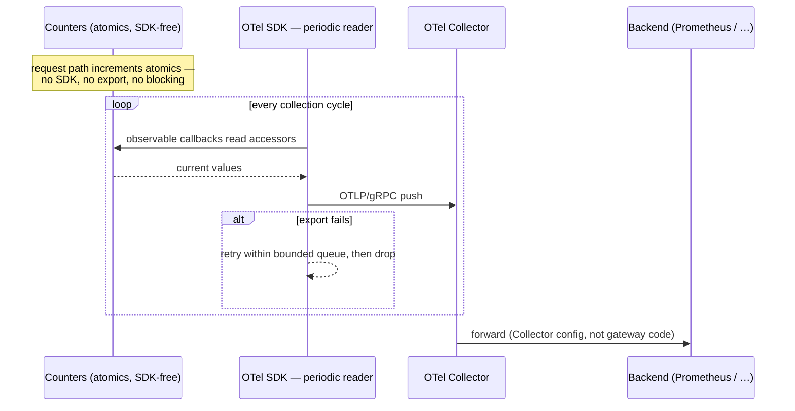

# ADR-002: Metrics are exported via OTLP push through the OpenTelemetry SDK

| | |
|---|---|
| **Subject** | How metrics leave the gateway — Prometheus scrape or OTLP push — and what that does to the existing plain-atomic counters |
| **Status** | Accepted (2026-08-03, decider: Fernando Fragateiro) |
| **Ticket** | GW-102 — build the exporter (GW-103 adds the provider-keys metrics on top) |
| **Parent** | Architecture brief — telemetry must never block the request path; export errors buffer, then drop with an internal alert |
| **Related** | ADR-001 (the staleness gauge this makes exportable), ADR-003 (needs the fail-open counter), `internal/metrics/*` |
| **Start date** | 2026-08-02 |
| **End date** | 2026-08-03 |

## Purpose

This document is the source of truth for metrics exposition: the gateway pushes over OTLP through the OpenTelemetry SDK, serves no `/metrics` endpoint, and bridges to its existing counters with observable instruments so those counters stay SDK-free. It defines what GW-102 builds and why `internal/metrics` is split across two package layers.

*Restructured 2026-08-04 into the current `ADR-STRUCTURE.md` template, and the "Why there are two packages" section added the same day. Otherwise format only — no decision or consequence was changed or dropped.*

## Scope

**In scope**

- The wire protocol and direction (push vs. pull) for metrics specifically.
- What happens to the existing counters in `metrics/gateway`, `metrics/providerkeys`, `metrics/api`.
- The package split between the counters and the exporter, and why it exists.
- Export-failure behavior and its relationship to the request path.

**Out of scope**

- Traces and logs. They already leave over OTLP; this ADR only brings metrics onto the same pipeline.
- The storage backend. Prometheus, Grafana Cloud, or anything else is Collector configuration, not gateway code — that is the point.
- Dashboards. The gateway exposes metrics; Grafana owns the pixels (brief non-goal).
- Which metrics exist. This decides transport, not instrumentation.

## Background — what each format actually is

Two different models for getting numbers out of a process:

**Prometheus exposition** is *pull*. The gateway exposes a plain-text HTTP endpoint (`GET /metrics`) listing every metric and its current value. A Prometheus server scrapes that endpoint on an interval (typically 15–60s) and stores the samples. The process holds only current values; the scraper owns history.

- Format spec: <https://prometheus.io/docs/instrumenting/exposition_formats/>
- Prometheus overview: <https://prometheus.io/docs/introduction/overview/>

**OTLP (OpenTelemetry Protocol)** is *push*. The gateway runs an OpenTelemetry SDK that batches metric data and periodically pushes it over gRPC or HTTP/protobuf to an OTel Collector, which forwards it to whatever backend is configured (Prometheus, Grafana Cloud, Datadog, …). The Collector is the vendor-neutrality layer: swap backends by editing Collector config, not application code.

- OTLP spec: <https://opentelemetry.io/docs/specs/otlp/>
- OTel metrics concepts: <https://opentelemetry.io/docs/concepts/signals/metrics/>
- OTel Collector: <https://opentelemetry.io/docs/collector/>

| | Prometheus pull | OTLP push |
|---|---|---|
| Transport | HTTP text endpoint, scraped | gRPC / HTTP protobuf, pushed |
| Extra infra | Just a Prometheus server | An OTel Collector in the path |
| App dependency | None required — the text format is writable by hand | OTel SDK (`go.opentelemetry.io/otel` + exporter + periodic reader) |
| Vendor lock-in | Prometheus-shaped, but the de-facto k8s standard; OpenMetrics-compatible | Vendor-neutral by design |
| Failure mode | A missed scrape loses one sample; the endpoint is passive | Export failures need buffering/retry handling in-process |
| Debuggability | `curl /metrics` shows everything | Numbers are invisible without a running Collector (or a debug exporter) |

## Decision Drivers

- **Nothing exports the numbers today.** `api.Deps.Metrics` is nil in main, so `GET /metrics` 404s: every metrics decorator (`metrics/gateway`, `metrics/providerkeys`, `RequestMetrics`, `PanicCounter`) exists and is tested, and none of it is visible anywhere.
- **The counters are deliberately SDK-free.** They are plain atomics behind accessor methods (`Attempts()`, `Failures()`, `FailuresByKind(kind)`), tied to no metrics library. The exporter must either read that surface as-is or force a rewrite of the counters onto a library.
- **Metrics are the only signal without a pipeline.** Traces and logs already ship over OTLP to an OTel Collector.
- **Telemetry can never block the request path.** The brief is explicit: export errors buffer, then drop with an internal alert.
- **Consumers are internal Grafana dashboards.** The brief's diagram originally showed Prometheus scraping `/metrics`; the brief was updated alongside this ADR's acceptance.

## Options Considered

### Option 1 — OTLP push via the OTel SDK — chosen

**Description:** Run the OTel metrics SDK with an OTLP/gRPC exporter and a periodic reader. Register **observable (asynchronous) instruments** whose callbacks read the existing accessor surface at each collection cycle, so the counters stay plain atomics, untouched. No `/metrics` endpoint; `api.Deps.Metrics` stays nil.

**Contract:** the adapter lives in `internal/metrics/otlp`, owns the `MeterProvider`, and exposes `Register*` functions that attach one port's counters to it. Collector endpoint comes from config.

**Pros:**
- Metrics, traces, and logs share one protocol, one Collector, and one resource identity — correlation in Grafana gets easier, and exemplars linking latency buckets to traces become possible.
- The counters and their tests don't change; the bridge is read-only callbacks over the existing accessors.
- Latency histograms come from the SDK instead of hand-rolled bucketing.
- Backend choice is Collector config; the gateway never changes to swap vendors.

**Cons:**
- Makes the Collector a runtime dependency for metrics.
- No `curl /metrics` debugging.
- Observable instruments can only report values that already exist, which bounds what breakdowns are possible (see **Why there are two packages**).

### Option 2 — Prometheus text, hand-rolled handler

**Description:** Write the exposition format by hand from the existing accessors and serve it at `GET /metrics`.

**Contract:** an `http.Handler` in `internal/api`; `api.Deps.Metrics` becomes non-nil.

**Pros:**
- Zero new dependencies, and curl-debuggable.
- A missed scrape is Prometheus's problem, not the gateway's — the endpoint is passive and cannot fail a request.

**Cons:**
- Creates a second telemetry pipeline: pull for metrics, push for traces and logs.
- Owns exposition-format correctness by hand.
- No histogram support — the latency-histogram requirement would be built from scratch.

### Option 3 — Prometheus text via `client_golang`

**Description:** Same pull model, but the library owns the format and the histograms.

**Contract:** `client_golang` registry and collector types re-backing the counters.

**Pros:**
- Format correctness and histograms for free.
- Still curl-debuggable, still passive.

**Cons:**
- Still the split-pipeline problem.
- A heavyweight dependency whose types would re-back the counters — the opposite of keeping them SDK-free.

### Option 4 — Hybrid: Prometheus now, OTLP bridge later

**Description:** Ship the scrape endpoint immediately and bridge to OTLP in a later change.

**Contract:** Option 2 or 3 now, Option 1 later, both present in between.

**Pros:**
- Fastest path to any visibility at all.
- Defers the SDK dependency.

**Cons:**
- Defers the convergence this decision wants, and leaves the split-pipeline state as the steady state in practice.
- Pays the integration cost twice.

## Flow Representation

**Pull (Options 2, 3, 4-then)**

```mermaid
sequenceDiagram
    participant PS as Prometheus server
    participant GW as Gateway (/metrics)
    participant CT as Counters (atomics)
    loop every 15–60s
        PS->>GW: GET /metrics
        GW->>CT: read accessors
        CT-->>GW: current values
        GW-->>PS: text exposition
    end
    Note over PS,GW: a missed scrape loses one sample;<br/>the gateway is passive
```

**Push (Option 1 — chosen)**



## Important Notes

- The Collector connection is established lazily by the exporter: a Collector that is down at startup does not fail the boot; it fails individual export cycles, which the SDK retries and then drops.
- `Shutdown` flushes the final export and must run before the process exits, or the last collection interval's data is lost.
- Label sets in the callbacks are the closed sets declared in `internal/gateway` (`FaultKind`, `ErrorCode`), enumerated explicitly — cardinality stays bounded regardless of traffic.
- The brief's acceptance criterion "after one request, `/metrics` shows `llm_tokens_total` incremented" is stated in Prometheus terms and must be restated as "the backend shows the series after one export interval."
- `grep -r go.opentelemetry.io internal/metrics/` returning only `otlp/` is the invariant the package split exists to hold.

## Summary

Every option gets the numbers out; they differ on which pipeline carries them and what that costs the counters. Pull is simpler and debuggable but forks the telemetry story in two and either hand-rolls the exposition format or re-backs the counters on a heavyweight library. Push converges all three signals at the cost of an SDK dependency and a Collector on the critical path for visibility — though never for serving.

Common to all: the counters already exist, are tested, and are the thing being protected. The option that rewrites them is the option that loses.

**Recommendation: Option 1.** It is the only one where the tested counters survive untouched — the observable-instrument bridge reads them rather than replacing them — and the only one that does not leave the gateway running two telemetry pipelines.

## Decision

The gateway exports metrics exclusively via OTLP push using the OpenTelemetry SDK — the same pipeline that already carries traces and logs to the OTel Collector. No `/metrics` endpoint is served and `api.Deps.Metrics` stays nil. The adapter lives in `internal/metrics/otlp` and registers observable (asynchronous) instruments whose callbacks read the existing accessor surface (`Attempts()`, `FailuresByKind(kind)`, …) at each collection cycle, so the counters stay plain atomics, untouched and SDK-free, per the adapters-at-the-edge architecture. The SDK's periodic reader pushes to the Collector endpoint from config; export failure is retried within the SDK's bounded queue and then dropped, never blocking a request. Storage backend becomes Collector configuration, not gateway code.

### Why there are two packages

`internal/metrics/gateway` (and `metrics/providerkeys`, `metrics/api`) and `internal/metrics/otlp` are not redundant — they are the two halves of this decision.

- **`internal/metrics/gateway` counts.** Each file is a decorator implementing a domain port (`gateway.UsageRecorder`, `gateway.ProviderClient`, …) that sits in the call chain and increments an atomic as each fact happens. It imports `sync/atomic` and `internal/gateway`, and nothing else.
- **`internal/metrics/otlp` publishes.** It holds the SDK's MeterProvider and registers observable instruments whose callbacks read those counters' accessors at each collection cycle. It is never on the request path.

Deleting the first leaves the callbacks with nothing to read; deleting the second leaves the numbers stranded in the process. The alternative — give the decorators synchronous `metric.Int64Counter`s and call `Add(1, attrs)` at the increment site — was rejected for the same reason this decision keeps the counters SDK-free: it puts `go.opentelemetry.io` into every port implementation and its constructor signature, requires a meter to unit-test a decorator, and spreads an SDK upgrade across the whole request path instead of four leaf files.

The price is pre-aggregation: an observable instrument reports a value that already exists, so a breakdown must be a bounded map the counter maintains itself (`rejectionsByCode`, `failuresByKind`). Open-ended labels like `llm_tokens_total{app,provider}` are therefore not available today; adding them means giving a counter an app-keyed map with an explicit cardinality bound, not collapsing the two packages.

**Known limitations:**

- **The OTel Collector is now a hard runtime dependency for metrics.** If it's down past the SDK's retry/queue bounds, datapoints are dropped silently from the gateway's perspective. **Mitigation:** the internal alert on export errors is load-bearing and must be part of GW-102's definition of done.
- **No `curl /metrics` debugging.** Verifying "did the counter move" requires the Collector (its `debug` exporter) or the backend. **Mitigation:** local dev needs a Collector in the compose/k8s setup — it is not optional tooling.
- **The brief's `/metrics` acceptance criterion no longer parses.** **Mitigation:** restated as "the backend shows the series after one export interval" — observable at earliest one push cycle later, not instantly.
- **`go.opentelemetry.io/otel/sdk/metric` plus the OTLP exporter is a substantial dependency subtree** in a repo that has avoided SDK coupling so far. **Mitigation:** contained to the one adapter package, and that containment is verifiable by grep.
- **Per-app and per-provider breakdowns are not available.** Observable instruments can only report pre-aggregated values. **Mitigation:** none today — it is the accepted price of the package split, and the upgrade path (a bounded app-keyed map on the counter) is documented above rather than discovered later.

## Revisit When

Collector availability incidents start costing metric data (the pull model's passivity becomes attractive again), or the cluster standardizes on scrape-based discovery for all workloads — at which point the Collector's `prometheusreceiver`/exporter can bridge without gateway changes, and only if that proves insufficient does an in-gateway `/metrics` endpoint return to the table.
