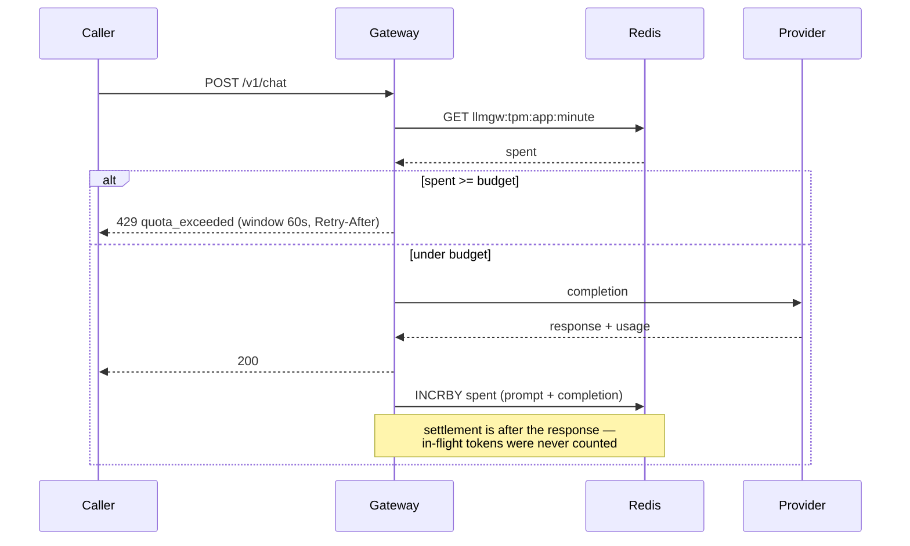
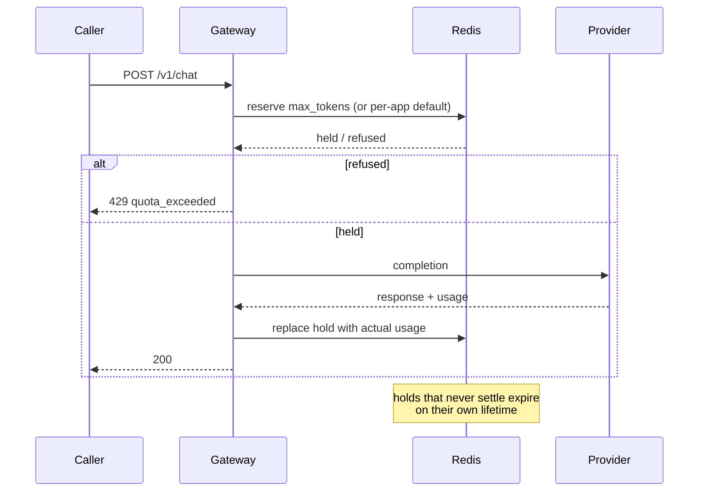

# ADR-003: `tokens_per_minute` is enforced as a check-before / debit-after budget in Redis

| | |
|---|---|
| **Subject** | Whether the parsed-but-inert `tokens_per_minute` config key becomes a real limiter or is deleted, and if enforced, on what semantics |
| **Status** | Accepted (2026-08-04, decider: Fernando Fragateiro) |
| **Ticket** | GW-104 — ADR-003: `tokens_per_minute` — enforce it or delete it |
| **Parent** | Architecture brief — isolation criterion ("rate quotas meter rps *and* tokens") and decision #1 (limiters fail open) |
| **Related** | GW-105 (implements this), GW-107 (zero-semantics), `TODO.md` §8, ADR-002 (the metrics this needs) |
| **Start date** | 2026-08-03 |
| **End date** | 2026-08-04 |

## Purpose

This document is the source of truth for how the third rate currency — tokens per minute — is metered, and for why the key was not simply deleted. It closes GW-104 and defines exactly what GW-105 builds: the semantics, the port, the Redis key shape, the failure behavior, and the limitations that ship with it.

## Scope

**In scope**

- Per-app enforcement of `config.AppLimits.TokensPerMinute`, currently parsed at `internal/config/config.go:47,175` and enforced nowhere.
- The admission verdict, the settlement write, and the behavior of both when Redis is unreachable.
- The port the core calls, and where it sits relative to the existing `RateLimiter` and `SlotLimiter`.
- Zero-semantics, consistent with the other currencies.

**Out of scope**

- Cost, pricing, or currency conversion. The gateway meters token *rate* as capacity, not spend — the brief's "not a billing system" non-goal stands, and was clarified alongside this ADR to say which of the two `tokens_per_minute` is.
- Per-provider or global token budgets. This is per-app only; the shared upstream allowance is protected indirectly, by pricing each app's share of it.
- Streaming. Usage arrives differently there and settlement would need rebuilding — noted as a revisit trigger.
- The implementation itself. GW-105 writes the Go.

## Decision Drivers

- **A config key that does nothing is worse than either alternative.** `tokens_per_minute: 200000` is set for all three apps in `config.example.yaml` and `deploy/configmap.yaml`. An operator can set it, watch an app spend ten times that, and get no signal. This is the driver that makes doing nothing unavailable.
- **The brief already promised it.** The isolation criterion reads "in both currencies: rate *and* slots. Rate quotas meter rps **and tokens**". Half the rate surface is inert while the criterion reads as met.
- **The providers meter tokens per minute themselves.** One credential per provider is shared by every app. An app that burns the account's TPM allowance does not degrade itself — it converts into 429s for every *other* app behind the same key. That is the noisy-neighbor failure slot ceilings exist to prevent (decision #7), in a currency slots cannot express.
- **Rps does not proxy for it.** A 2 rps app sending 100k-token prompts outspends a 40 rps app sending 500-token prompts by two orders of magnitude — the same argument that made slots a separate currency, on a different axis.
- **Tokens are unknowable at admission.** A request is one request; a completion's cost is known only when the response returns. Every option below is a different answer to "what does the gateway compare against at the moment it must decide?"
- **Auth fails closed, quotas fail open (decision #1).** Whatever this adds must sit on the fail-open side, or a Redis blip becomes a total outage through a new door.
- **Redis ops are budgeted.** The brief's latency work assumes ~3 Redis ops per request against a < 50 ms p95 overhead criterion. A token currency adds ops on every *served* request, not just on rejections.

## Options Considered

### Option 1 — Check-before / debit-after, fixed 60s window

**Description:** At admission the gateway reads the app's already-settled spend for the current minute and refuses if it is at or above budget. After a completion is served, it debits the response's actual `prompt_tokens + completion_tokens`. Nothing is held or reserved in between — requests in flight are invisible to the check.

**Contract:** key `llmgw:tpm:<app>:<unix-minute>`, TTL 61s. Admission is one read; settlement is one `INCRBY`-plus-`EXPIRE`-on-first-write script, the same atomicity pattern `internal/redis/limiter.go` already uses for rps.

**Pros:**
- Reuses everything the rps limiter established: client, key convention, TTL-outlives-the-window rule, fail-open policy, zero-means-unmetered.
- Two Redis ops per served request, both O(1), both skipped entirely for unmetered apps.
- No state beyond a counter — nothing to reconcile, nothing to expire, nothing to leak if a request dies mid-flight.
- The verdict is explainable to the caller from the counter alone: budget, spend, seconds to the window edge.

**Cons:**
- Overshoot. An app one token under budget is admitted, and everything already in flight settles afterward. The budget is a soft ceiling, bounded only by `max_in_flight × tokens_per_completion`.
- The debit is a second failure point with no caller left to tell — a Redis error after the response is on the wire can only be logged.
- Fixed window doubles at the seam: full budget at second 59, full budget again at second 61.

### Option 2 — Reserve at admission, reconcile at settlement

**Description:** At admission the gateway holds the request's `max_tokens` against the budget, then replaces the hold with actual usage when the response returns. In-flight requests are visible to the check, so the budget becomes a genuine ceiling.

**Contract:** the counter plus a per-request reservation ledger, each entry expiring independently so a request that dies mid-flight releases its hold.

**Pros:**
- Tight. Overshoot is bounded by the reservation, not by the slot ceiling.
- Concurrency-safe by construction — the noisy-neighbor case this ADR exists for is fully priced before it happens.

**Cons:**
- `max_tokens` is optional in the OpenAI-compatible schema this gateway accepts. Requests without it need a per-app default reservation — a config knob whose only job is to guess, and whose wrongness silently over- or under-throttles.
- Reservations that never settle need their own expiry, which is a second lifetime to get right on top of the window's.
- Over-reserving punishes well-behaved callers: an app that sets a generous `max_tokens` and consistently uses a fraction of it gets throttled on tokens it never spent.
- Three to four Redis ops per served request rather than two.

### Option 3 — Delete the field

**Description:** Remove `TokensPerMinute` from both structs, from `config.example.yaml` and `deploy/configmap.yaml`, and add a loader test proving an old config carrying the key is rejected. Two currencies — rps and slots — are declared sufficient.

**Contract:** none. The strict loader means the break is loud: configs with the key fail at boot with a clear message.

**Pros:**
- Cheapest possible resolution, and it makes the config honest immediately.
- No new Redis ops, no new port, no new failure mode, no overshoot to explain.
- Defensible on its own terms: slots already bound how much an app can have in flight.

**Cons:**
- Contradicts the brief's isolation criterion, which would have to be rewritten to drop tokens from the rate currency.
- Deleting the key does not delete the problem. One app exhausting the shared provider TPM allowance stays invisible until it surfaces as unexplained 429s in a *different* app — the hardest class of incident to attribute.
- Slots bound concurrency, not consumption. Ten slots of 100k-token prompts and ten slots of 500-token prompts are identical to the slot limiter and two orders of magnitude apart upstream.

## Flow Representation

**Option 1 — check-before / debit-after**



**Option 2 — reserve / reconcile**



**Option 3** has no flow — it removes one.

## Important Notes

- `QuotaDetail` (`internal/gateway/errors.go:42`) already carries `Limit`, `WindowSeconds`, `Used`, and the rps limiter already returns `RetryAfter` pointing at the window edge. A token refusal fits the existing unified error with `WindowSeconds: 60` and needs no new error code — `CodeQuotaExceeded` covers it.
- Consequence of that reuse: rps and token refusals are indistinguishable to a caller except by `WindowSeconds` (1 vs 60). Either that is documented as the discriminator or `QuotaDetail` grows a name field — a small call left to GW-105.
- The admission comparison must be `>=`, not `>`. Because the debit lands after the fact, the only question admission can honestly ask is whether the app has already spent its minute.
- Worst-case overshoot with the example config: `agent-service` has `tokens_per_minute: 500000` and `max_in_flight: 300`. Three hundred concurrent completions can all pass a check taken at 499,999 and settle afterward.
- `UsageRecorder` was the seam the GW-104 ticket floated, since it already sees `(app, usage)` per completion. It does not survive inspection: `RecordCompletion` takes no `context.Context` and returns no error, so it cannot own a Redis round trip honestly, and it is the observability chain — making it load-bearing for enforcement breaks the rule that logging and metrics decorators are removable without changing behavior.
- Zero-semantics precedent is settled: `config.go:211` treats `GlobalMaxInFlight` as unenforced at zero, and `redis.NewLimiter` documents "a zero limit and an app with no entry both mean unmetered". A token budget must follow it.

## Summary

All three options agree on the diagnosis: the key is inert, and that is not a state anything can stay in. They agree that slots and rps do not, between them, price the upstream token allowance. And options 1 and 2 agree that enforcement is necessarily split across the request — a verdict before, a true cost after — because usage does not exist at admission.

They differ on one thing: what fills the gap between those two moments. Option 1 leaves it empty and accepts overshoot. Option 2 fills it with an estimate and accepts that the estimate is a config guess. Option 3 declares the gap not worth crossing.

**Recommendation: Option 1.** The estimate Option 2 depends on is not available — `max_tokens` is optional in the accepted schema — so its tightness is bought with a knob that guesses, and a guess that throttles real traffic is a worse failure than an overshoot that is visible and bounded. Option 3's cost is not the deleted key; it is that the incident it permits lands on an app that did nothing wrong.

## Decision

The gateway enforces `tokens_per_minute` as a per-app, Redis-backed budget with check-before / debit-after semantics on a fixed 60-second window keyed `llmgw:tpm:<app>:<unix-minute>`.

At admission, after the rps check and before a provider is contacted, the gateway reads the app's settled spend for the current window. If that spend is at or above the configured budget, the request is refused with `CodeQuotaExceeded` and a `QuotaDetail` carrying the budget, the spend, and `WindowSeconds: 60`, plus `Retry-After` pointing at the window edge — the same unified error shape the rps limiter produces. After a completion is served, the gateway debits the actual observed usage of the response that was returned to the caller, using an `INCRBY`-plus-`EXPIRE`-on-first-write script.

The seam is a new port declared in `internal/gateway` beside the other two limiters — not a third method on `RateLimiter`, whose entire job is one pre-flight question, and whose implementations and decorators would all have to grow a method that has no verdict to return:

```go
// TokenLimiter meters the token-rate currency: the upstream providers cap
// tokens per minute on the shared credential, so an app's share of that
// allowance is priced here rather than discovered as another app's 429.
type TokenLimiter interface {
	// Check reports whether app has budget left in the current window,
	// judged on spend already settled — tokens in flight are invisible.
	Check(ctx context.Context, app string) (RateDecision, error)
	// Settle debits what a served completion actually cost.
	Settle(ctx context.Context, app string, tokens int) error
}
```

**Rules that follow:**

- A budget of `0`, or an app with no entry, means the currency is unmetered for that app and costs zero Redis operations — the convention `GlobalMaxInFlight`, the rps limiter, and the slot limiter already share.
- On a Redis error the currency fails open in both phases. Admission admits the request and records the degradation through the existing `RecordRateLimiterFailOpen` path; settlement logs and drops, because failing a request the caller has already been served is strictly worse than under-debiting a budget.
- Only served completions debit. Attempts that were abandoned — a timeout that failed over, a garbage 200, a caller that disconnected — do not: the gateway holds only an upper-bound estimate for those, they are already recorded in `unobserved_spend_tokens_estimate`, and letting an estimate refuse real traffic would turn a number the brief calls unobservable into an enforcement input.
- The token check runs after the rps check, so the cheaper and more exact verdict wins first and a request refused on rps costs no token read.

**Known limitations:**

- **The budget is a soft ceiling.** Worst-case overshoot in a window is roughly `max_in_flight × tokens_per_completion`. **Mitigation:** slot ceilings become load-bearing for token containment — defensible, since it is the same isolation argument as decision #7, but it means an app's `max_in_flight` must now be set with its token budget in mind, and that belongs in the config documentation.
- **Redis ops per served request go from ~3 to ~5**, against a < 50 ms p95 overhead criterion measured without them. **Mitigation:** both ops are O(1) and both are skipped for unmetered apps; the admission read can later fold into the rps `EVAL` as one script returning both counters. The brief's load test must be re-run rather than assumed.
- **Settlement can fail silently.** A Redis error after the response is sent under-debits the window, and the app gets free tokens until it rolls. **Mitigation:** its own counter, distinct from the shared fail-open metric — otherwise the gap is invisible, which the design forbids.
- **The enforced number is "tokens the gateway observed", not "tokens the provider billed."** Abandoned attempts deliberately do not debit, so enforcement drifts loose during a provider incident — exactly when real spend runs high. **Mitigation:** the divergence is measurable against `unobserved_spend_tokens_estimate`; that measurability is the only reason it is acceptable.
- **The fixed window doubles at the seam** — full budget at second 59, full budget again at second 61. **Mitigation:** none; inherited from the rps limiter, and a sliding window would fix both together or neither.

## Revisit When

Observed overshoot stops being academic: a window where an app's settled spend exceeds its budget by more than ~20%, or any incident where token overshoot contributes to an upstream 429. The next design is Option 2 — reserve at admission, reconcile at settlement — which turns the soft ceiling into a hard one at the cost of a reservation ledger and a per-app default estimate.

Revisit sooner if streaming lands: usage arrives in a terminal chunk or not at all, and settlement has to be rebuilt around that (the same trigger already listed against the failover policy).
