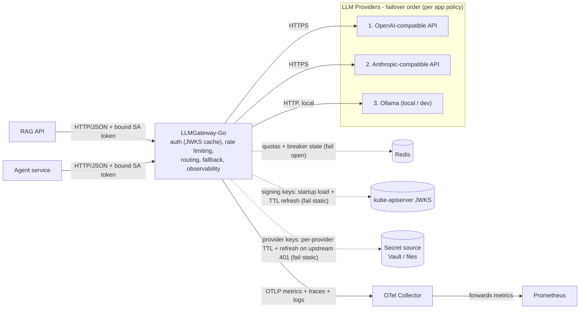

# Architecture Brief — LLMGateway-Go

A personal project: a small gateway that sits between my apps and LLM providers.

## Problem

Every app that talks to LLMs ends up rebuilding the same plumbing: one integration per provider (OpenAI, Anthropic, Ollama), API keys copy-pasted around, no shared rate limits, and no idea what anything costs or why it's slow — until a provider goes down and takes the app with it.

## What it does

The LLM Gateway is one front door for every model. An app makes a single, consistent API call — the gateway takes it from there: translating to each provider's format, holding the API keys in one place, and enforcing limits per app. Add a new provider or swap models? Config change, not a code change.

## Why it's needed

Two big payoffs. First, you can finally see what's going on: every request is tracked, so latency, errors, and token spend show up per app and per provider instead of vanishing into the void. Second, no app is hostage to one provider's bad day — requests automatically fail over to a backup route, under substitution rules each app chooses, and the response always names the model that actually answered.

## Goal

Give every app I build one simple, reliable way to use any LLM provider — with centralized auth, rate limiting, full cost/latency visibility, and policy-controlled failover built in.

## Build vs. buy

For a company, the first question a reviewer asks is "why not LiteLLM?" For a personal project the honest first answer is: **building the gateway is the point** — the failure policies, the capacity math, and the API contract are exactly the skills this project exists to exercise. Still, the landscape matters, because knowing what you didn't use is part of the design:

| Option | What it gives | Why not here |
|---|---|---|
| **LiteLLM Proxy** (OSS, Python) | The closest match: unified API, fallbacks, budgets, logging | What I'd reach for at work. Using it here would teach me its config file, not gateway design — and the parts I care about (fail-static keys, the substitution contract, double-spend accounting) are the parts it doesn't express. |
| **Kong / Envoy AI plugins** | Battle-tested proxy cores | A whole platform to learn in order to avoid writing a thin service; policy lives in plugin config where my contract doesn't map. |
| **SaaS gateways** (Portkey, Cloudflare AI Gateway, OpenRouter) | Zero ops | My prompts transit a third party, and everything interesting happens inside a black box I can't learn from. |
| **A shared client library** | No new service | A library can't *enforce*: keys stay scattered, limits can't be global, and nothing stops an app calling a provider directly. |

The escape hatch that makes building safe: apps see an OpenAI-compatible contract, so swapping this gateway for LiteLLM or a SaaS later is a config repoint, not an app migration. The code is disposable; the contract isn't.

## Who uses it

Every app calls the gateway — never a provider directly. Each app declares a failover policy when it's added to the config (see *The failover contract*):

- **RAG API** (demo app) — Q&A over documents. Many short calls, latency-sensitive. Load-test assumption: ~40 rps, provider p95 ~4 s. Policy: `any` — availability over fidelity.
- **Agent service** (demo app) — multi-step agent with tool calls. Few but *long* calls: ~2 rps, 30–120 s each, token-heavy. Policy: `same-model` — tool-call fidelity matters; no substitutes.

Operator and observability consumer: Grafana for the metrics, the provider billing dashboards for the monthly truth.

## Scale & capacity targets

The key insight: this gateway barely computes anything. It spends its life **waiting** for providers to answer. So the resource that runs out first isn't CPU — it's how many requests it's holding open at the same time. Call each one a **slot**.

The math is one line: `slots ≈ requests per second × seconds each request stays open`. Two examples from my own apps:

- RAG API: 40 rps × 4 s = **160 slots** — lots of traffic, modest occupancy.
- Agent service: 2 rps × 120 s = **240 slots** — 2% of the traffic, but *more* slots than the busy app.

That's the trap: averaging the two ("blended p95") hides the slow one. Slots must be counted **per app, then added** — which is also why one slow app can quietly starve a fast one if nothing stops it.

The targets (a design exercise — chosen to make the numbers force real decisions, not because I have this traffic):

| What | Target | Why |
|---|---|---------------------------------------------------------------------------------------------------------------------------------------------------------------------------------------------------------------------------------------------------------------|
| Sustained load | 100 rps (300 burst) | The load-test bar everything below must hold at                                                                                                                                                                                                               |
| Global in-flight cap | 800 slots | RAG at full load (~400) + agents at peak (~240) + headroom. Also bounds memory: 800 × 512 KB max bodies ≈ 400 MB worst case                                                                                                                                   |
| Per-app ceilings | Agent 300 / RAG 600 | The anti-starvation rule: no app can hold more than its ceiling, so agents can never eat RAG's slots. Ceilings add up to 900 > 800 **on purpose** — both apps rarely peak together, so they share the spare capacity; the global cap settles the rare overlap |
| Redis | ~3 ops/request → under 1k ops/s | Nowhere near Redis's limits; a single instance is fine                                                                                                                                                                                                        |
| Deployment | Kubernetes: 2–3 replicas, HPA scaling on in-flight slots, not CPU | CPU stays near idle on a service that waits — a CPU-based HPA would never fire; slot counters are the honest load signal |                                                                                                                                                                        |

## The failover contract

Failover is a contract term, not an implementation detail: swapping to a different model silently changes output quality, token counts, and behavior. So substitution is governed, not assumed.

- **Route failover** — the identical model via another route (same weights, second host). A transport fact, not a judgment; always allowed.
- **Model substitution** — a different model. A judgment that belongs to the app alone — the gateway never declares two models interchangeable.

Per-app policy, in config:

```yaml
apps:
  rag-api:
    failover_policy: any                     # take whatever the failover order offers
  agent-service:
    failover_policy: same-model              # route failover only; no substitutes, ever
  # third form, when an app wants named substitutes:
  # support-bot:
  #   failover_policy:
  #     allowlist: [gpt-4.1, claude-sonnet-4]  # acceptable substitutes, preference order
# default for new apps: same-model (conservative; substitution is opt-in)
```

Who decides what: the gateway config holds the **routes list** — which endpoint serves which model, plain transport facts. Each app's own config block holds its **policy** — the semantic judgment. There is no equivalence table, deliberately: that would be the gateway deciding two models are interchangeable on an app's behalf.

Disclosure is unconditional: the response `model` field always names the model that *actually served* the request (never echoes the requested one), and `X-Model-Substituted: true` is set whenever a swap occurred. When policy leaves no eligible route, the caller gets 503 `model_unavailable` — availability traded for fidelity, on record.

Honest consequence, today: with the current three providers, no model is served by two routes — so `same-model` presently means **no failover at all**. The Agent service accepts provider outages until a second route for its model exists. That's the recorded trade, not a gap.

## Success Criteria

- Every LLM call goes through the gateway — no app holds a provider key, SDK, or hostname, and the network refuses direct calls.
  Verify: grep the app repos → nothing; block direct provider egress (docker-compose network / k8s NetworkPolicy) and curl a provider from an app container → connection refused. Violated: any app completes a direct provider call.
- Going through the gateway costs less than 50 ms extra (p95) — at design load, not at idle.
  Verify: load test at 100 rps sustained / 300 rps burst, direct vs. via gateway (same model, no streaming) → the p95 difference stays under 50 ms. Violated: delta ≥ 50 ms at target load, or the error budget breaks during the burst.
- When a provider goes down, apps don't notice — the fallback absorbs it, scoped by each app's declared policy.
  Verify: stub or firewall the primary provider for 10 minutes at 1 rps → for the `any`-policy app, ≥ 99.9% of requests still succeed; for a `same-model`/allowlist app with no eligible route, requests fail fast as 503 `model_unavailable` — its recorded choice, not a gateway failure. Violated: the `any` app's error rate exceeds 0.1%, or a conservative app silently receives a model outside its declaration.
- Spend is traceable per app, and it reconciles with the provider bills — after accounting for spend the gateway provably cannot observe.
  Three cases let a provider bill tokens the gateway never sees (timeout failover, garbage-200 failover, caller disconnect — see decision #6). Each records an upper-bound estimate in `unobserved_spend_tokens_estimate` (the request's `max_tokens`, or parsed usage when available). In normal weeks the effect is well inside the tolerance; during a provider incident it isn't — which is why it's measured, not assumed.
  Verify: send 100 requests as one app → next day `sum(llm_tokens_total{app="rag-api"})` matches the provider dashboard within ±1%; for any window, billed − recorded ≤ 1% + the estimate. Violated: query empty, or the residual gap exceeds 1% after the estimate is applied.
- An app hitting its limits gets throttled; the others keep flowing — in both currencies: rate *and* slots. Rate quotas meter rps and tokens; ceilings meter slots (an app can sit far under its rps quota while holding hundreds of slots for minutes — the slow-app starvation path).
  Verify (rate): exhaust app A's quota while B sends concurrently → A gets 429, B gets 200.
  Verify (slots): saturate the Agent service to its ceiling with 120 s calls → its next request gets 429 + Retry-After, while RAG API p95 overhead stays < 50 ms with zero RAG rejections caused by agent load.
  Violated: B throttled by A's usage in either dimension, A not throttled at all, or RAG latency degrades during agent saturation.
- Adding or swapping a provider never touches an app.
  Verify: change gateway config → requests route to the new provider with app binaries untouched. Violated: any app rebuild or code change required.

## MVP Definition of Done

### Core behavior

- Chat completion works. POST /v1/chat with a valid body and a valid ServiceAccount token returns 200 with non-empty message and an X-Correlation-ID header. Violated by non-200, empty content, or a missing header.
- Malformed input is rejected before any provider is contacted. POST /v1/chat with an invalid body returns 400 with the unified error body naming the parse error; the provider request counter is unchanged. Violated by any 5xx or an upstream call.
- The served model is always disclosed. Every 200 response's `model` field names the model that actually produced it. Violated if a response ever claims the requested model while another served it.

### Auth & limits

- Auth is enforced. A request without a valid bound ServiceAccount token — missing, expired, wrong audience, wrong issuer, or signed by a key not in the JWKS cache — returns 401 with the unified error body and is never forwarded. Violated by anything but 401, or an incremented provider counter.
- Rate limiting is enforced. Sending quota+1 requests in one window returns 429 with a Retry-After header on the final request. Violated if no 429 arrives, or it arrives early.
- Slot ceilings are enforced. With one app holding its max in-flight slots on long calls, its next request returns 429 with Retry-After while another app's simultaneous request returns 200 within the overhead budget; `in_flight{app}` and `concurrency_limit_rejections_total{app}` reflect it. Violated if the over-ceiling request is admitted, or the other app's request is delayed or rejected.
- Provider keys live only in the gateway (loaded from the secret source), never in app code or logs.

### Resilience

- Substitution is honored and flagged. For an app with `failover_policy: any`, with the primary stubbed to return 500, a valid request returns 200 served by the fallback, the response `model` names the substitute, and `X-Model-Substituted: true` is present — with exactly one attempt on the primary. Violated if the caller sees 5xx, the primary is attempted twice, or the response claims the requested model.
- Conservative policy refuses substitutes. For an app with `failover_policy: same-model` and no second route for that model, with the primary stubbed to return 500, the caller gets 503 `model_unavailable` with the unified error body; no other provider's request counter moves. Violated by any request reaching a provider that doesn't serve the requested model.
- Total failure is bounded. With all eligible providers stubbed to fail, the caller gets 502 with the unified error body within the total request deadline. Violated by a hang past the deadline or a leaked raw provider error.
- Timeouts are honored. With a provider stubbed to sleep past the per-try deadline, the gateway aborts and fails over per policy; total duration stays within the total budget. Violated if the request exceeds the budget.
- A rejected provider key fails over and self-heals. With the primary stubbed to return 401 and an `any`-policy app: the caller gets 200 from the fallback, exactly one attempt hits the primary, and `provider_key_refresh_triggered_total{provider}` increments while the request path shows no added latency from the refresh. Hold the primary at 401 under sustained load: triggered refreshes stay cooldown-bounded instead of tracking request rate, and the cached key is still present. Violated if the caller ever sees 401, if refresh count scales with request count, if the refresh blocks the request, or if a rejection empties the cache.

### Observability & ops

- Traceability is end-to-end. A request sent with X-Correlation-ID: test-123 echoes the ID in the response, and a log query, metric exemplar, and trace lookup for test-123 all hit. Violated if the ID is absent from any signal.
- Usage is recorded. After one request, the metrics backend shows `llm_tokens_total{app,provider}` incremented and a latency histogram observation within one export interval — metrics leave the gateway via OTLP push, not a scrape endpoint (see [ADR-002](../ADRs/ADR-002-metrics-exposition.md)). Violated if the series are unchanged after an export interval has elapsed.
- Health reflects dependencies, per cache and independently. GET /healthz returns 200 {"status":"ok"}. With the secret source stopped: a warm instance keeps serving (fail static) and `provider_key_cache_age_seconds{provider}` rises for each affected provider; a freshly restarted instance with no servable route — every keyed provider's source unread and no keyless route configured — never reports ready. With the JWKS endpoint stopped, the same two behaviors hold against `jwks_cache_age_seconds`. Each cache gates readiness on its own — a stalled secret source must not mark the JWKS cache unready, or vice versa — and one provider's unreachable source must not hold back a provider whose own source read fine. Violated if a warm instance goes unready during either outage, if an instance with no servable route receives traffic, if a deployment that configures no provider secrets at all (every route self-hosted) fails readiness — having nothing to load is a valid steady state, not a cold cache — or if one provider's unreachable source makes the instance unready while another provider's route is servable.

## Failure Modes

### Retry Classification

| Class | Retry policy |
|---|---|
| **Deterministic** | Never retry, never fail over — same input, same result. Reject fast. |
| **Provider-scoped (transient)** | One failover, honoring the app's substitution policy (`same-model` / allowlist / `any`) — a "fallback" never changes model semantics beyond what the app declared; with no eligible route, fail fast with 503 `model_unavailable`. Never retry the same provider. Bounded by a *total* request deadline, not stacked per-try deadlines. |
| **Gateway / global** | No retry possible — fail fast with 5xx so the caller's own retry policy (with its own backoff budget) takes over. |
| **Gateway-internal (degrade)** | No retry — degrade gracefully; never block the request path. |

*Provider-scoped rows below assume the app's policy permits the fallback route; where it doesn't, "200 via fallback" becomes 503 `model_unavailable`.*

| Failure | Class | How gateway detects it | What gateway does | What caller sees | Why no (same-provider) retry |
|---|---|---|---|---|---|
| Caller sends invalid JSON | Deterministic | JSON decode fails before any provider is contacted | Reject immediately; never forwarded | 400, unified error naming the parse error | Same input → same result; retrying masks a caller bug |
| Caller sends oversized body | Deterministic | Body exceeds configured max during read | Reject before buffering the rest | 413, unified error stating the limit | Deterministic — the body won't shrink |
| Caller's ServiceAccount token is invalid, expired, or wrong-audience | Deterministic | Local JWT verification fails against the cached JWKS — signature, issuer, audience, or expiry | Reject; never forwarded | 401, unified error | Deterministic until the kubelet projects a fresh token; a TokenReview call would add a request-path dependency on the apiserver for the same answer |
| Caller over quota | Deterministic | Rate limiter counter exceeded | Reject; never forwarded | 429, unified error with quota info | Deterministic until the window resets; that's the caller's backoff job |
| App at slot ceiling | Deterministic | Per-app in-flight semaphore exhausted | Reject; never forwarded; increment `concurrency_limit_rejections_total` | 429 + Retry-After, unified error naming the ceiling | Deterministic until one of the app's own slots frees — queueing inside the gateway would hide the starvation instead of pricing it |
| Caller disconnects mid-request | Deterministic | Inbound context canceled (`context.Canceled`) | Abort outbound call (stop *future* token spend); increment `unobserved_spend_tokens_estimate` — upstream may bill what was already generated; log `client_disconnected` | Nothing — caller is gone; traceable via correlation ID | No one left to answer; a retry spends tokens nobody receives |
| DNS / TLS / connection failure to primary | Provider-scoped | Outbound dial error (NXDOMAIN, refused, cert error) — zero bytes sent | Fail over immediately per policy; circuit-break primary after N consecutive failures | 200 via fallback; 502 if both fail | Only *theoretically* safe same-provider retry (provider never saw it) — but failover strictly dominates: works when provider is down, not just flaky |
| Primary provider times out | Provider-scoped | No response before per-try deadline (`context.DeadlineExceeded`) | Abort the primary call (best effort — upstream may still complete and bill), fail over once per policy; increment `double_spend_risk_total` | 200 (slower); 502 if fallback also fails | Cost doesn't discriminate — the primary may bill whether we retry it or fail over, so the possible double spend is accepted (decision #6). What differs is odds and blast radius: the fallback is healthy, the primary just proved it isn't, and re-hitting it piles onto a struggling upstream |
| Primary provider returns 5xx | Provider-scoped | Response status ≥ 500 | Fail over once per policy; count toward circuit breaker | 200 via fallback; 502 if both fail | A 5xx won't heal in milliseconds; re-hitting a struggling upstream amplifies its incident into yours |
| Provider returns 429 (provider-side quota) | Provider-scoped | Response status 429 | Fail over per policy; put primary in cooldown. Never mapped to caller's 429 | 200 via fallback; 502 naming upstream capacity if none left | Caller didn't exceed *their* quota; re-hitting a saturated upstream is a retry storm by definition |
| Provider rejects the gateway's own key (401/403) | Provider-scoped | Response status 401 or 403 | Fail over once per policy; trigger an out-of-band provider key refresh (decision #8) — asynchronous, never on the request path; count toward the circuit breaker; never evict the cached key | 200 via fallback; 503 `model_unavailable` where policy allows no substitute; 502 if the fallback also fails — **never the caller's own 401** | The credential the provider just refused is the identical one a second attempt would send, so the outcome is already known. Only a refresh can change the answer, and it happens off this request |
| Provider returns 200 but garbage (malformed/truncated/schema mismatch) | Provider-scoped | Response decode/schema validation fails | Treat as provider failure; fail over once per policy; log raw sample; increment `double_spend_risk_total` | 200 via fallback; 502 naming invalid upstream response | The primary already billed for the garbage — failover knowingly pays twice (decision #6); the alternative is charging the caller's latency budget and returning nothing for tokens already burned |
| Provider slow but under deadline | Provider-scoped | Per-provider latency histogram degrades | Nothing per-request; health score demotes provider for *new* requests | Slower 200s until routing adjusts | Nothing failed — acting per-request would trade a slow success for an uncertain one |
| All providers exhausted | Gateway / global | All policy-eligible attempts failed | Return unified error; raise an alert | 502, unified error body | No healthy path left; retrying from inside only burns the caller's remaining timeout |
| Stale JWKS cache (cluster JWKS endpoint unreachable past TTL) | Gateway-internal | JWKS refresh job errors; `jwks_cache_age_seconds` exceeds TTL | **Fail static** — keep verifying against last-known-good signing keys; alert on staleness age | Nothing, until the cluster rotates its signing key: tokens signed by the new key hit an unknown `kid` and are refused 401 | Staleness is bounded and visible; fetching JWKS on the request path adds latency and a hard dependency on the apiserver being up |
| Stale provider key cache (secret source unreachable past TTL) | Gateway-internal | A provider's key refresh errors; `provider_key_cache_age_seconds{provider}` exceeds that provider's TTL — staleness is per provider, since each has its own source and cadence | **Fail static** — keep sending last-known-good provider keys; alert on staleness age | Nothing, until the provider revokes the stale key — then that provider's calls fail upstream, failover carries the load, and the rejection schedules an out-of-band refresh (decision #8) that keeps failing while the source is down | Staleness is bounded and visible; retrying a dead secret source in the request path adds latency, not truth |
| Cold start with the JWKS endpoint down (signing keys never loaded) | Gateway / global | Startup JWKS load fails; readiness never passes | Instance refuses readiness; traffic goes to healthy instances | Nothing — traffic never reaches the unready instance | With no signing keys there is no basis to authenticate anyone; failing closed at startup harms zero in-flight traffic |
| Cold start with secret source down (provider keys never loaded) | Gateway / global | A configured provider's startup key read fails; readiness never passes | Instance refuses readiness; traffic goes to healthy instances | Nothing — traffic never reaches the unready instance | With no provider keys there is no basis to call any provider that needs one. The gate is *at least one route is actually servable* — a provider whose source loaded, or a route needing no key at all — never *the cache is non-empty*. An all-self-hosted deployment is therefore ready immediately with zero secrets configured, and one provider's dead source degrades routing instead of grounding the pod. Requiring **every** source to load would be worse than the failure it guards against: replicas share one secret source, so no healthy instance exists to shed to, and one unreachable vault path would take the whole gateway down for the providers that are fine — the total-outage-from-a-partial-fault shape decision #1 rejects elsewhere |
| Redis (quotas + breaker state) down | Gateway-internal | Limiter/breaker calls error or time out | **Fail open** + raise an alert; no breaker state = try primary normally | Normal 200; quota temporarily unenforced | Availability over enforcement — neither key cache lives in Redis by design, so no shared fate with auth |
| Gateway process exhaustion (memory, FDs, pool) | Gateway / global | Accept/dial errors, OOM kill, liveness probe fails | Kubernetes restarts the pod; body caps + slot caps bound the blast radius | Connection reset or 503 from the Service during restart | The retrying component is the one that's broken — recovery is external (the orchestrator) |
| Metrics/log sink down | Gateway-internal | Telemetry export errors | Buffer, then drop with an internal alert; never blocks request path | Nothing different | Observability must never gate the data path |

## Design decisions this table commits us to

1. **Auth fails static, rate limiting fails open — and they must not share a failure domain.** Two *separate* caches live in gateway memory, each loaded at startup and refreshed on its own TTL, each failing static: the **JWKS cache** holds the cluster's token-signing keys (from `auth.jwks_url`) and is the only thing that authenticates a caller; the **provider key cache** holds outbound provider credentials (from `secret_source`) and authenticates nobody — it is spent on the gateway's own calls to OpenAI and Anthropic. Those credentials come from **HashiCorp Vault via its Kubernetes auth method** — the gateway trades its own projected ServiceAccount token for a Vault token, so no credential has to be distributed in order to read credentials — or from mounted files, with one source per provider and a refresh cadence each. They are not one mechanism with two uses: inbound identity comes from the kube-apiserver, outbound credentials from the secret source, and neither outage implies the other. Quota and breaker counters live in Redis. A Redis outage degrades enforcement, never availability. Only a cold start fails closed, and only at readiness where no traffic is harmed: an instance that has never loaded signing keys cannot authenticate anyone, and one that has never read the secret source cannot call a provider that needs a key. (If keys and quotas shared one store, a single outage would trigger both policies and fail-closed would win — the asymmetry would be unreachable.)
2. **One failover attempt, total-deadline bounded** — never a second attempt at the same provider; per-try deadlines must not stack past the caller's budget.
3. **Caller disconnect aborts the upstream call** — cost control: never pay for tokens nobody will receive.
4. **Provider errors are never leaked raw** — every caller-visible error is the unified body + correlation ID; upstream 429s are never presented as the caller's fault.
5. **Failover is a contract term, not an implementation detail.** Each app declares a substitution policy (`same-model` / allowlist / `any`, default `same-model`); the response always discloses the model that actually served it (`model` field + `X-Model-Substituted` header). Route lists are transport facts in gateway config; substitute lists are the app's own declarations — the gateway never judges two models interchangeable. Conservative apps thereby accept that a provider outage can reach them as 503 `model_unavailable` — availability traded for fidelity, on record.
6. **Failover after timeout or garbage-200 accepts possible double token spend.** The cost argument cuts both ways — the primary may bill regardless of what happens next — so this policy spends the second attempt where success is most likely, buying availability with money that was already at risk. Exposure is bounded per-request by `max_tokens` and made observable via `double_spend_risk_total` plus its token companion `unobserved_spend_tokens_estimate` (upper bound per event: the request's `max_tokens`, or parsed usage when available) — the same estimate the billing-reconciliation criterion subtracts, so this decision and that criterion cannot drift apart. When the estimate becomes material against real spend, that's the trigger to tighten per-try deadlines or open a hedging ADR.
7. **Slots are a metered resource, like rps and tokens.** The Agent service proves rate quotas alone don't isolate: 2% of the traffic can hold 40% of the slots. Per-app max-in-flight ceilings (429 + Retry-After on breach) sit over a deliberately oversubscribed global cap — ceilings bound any one app's blast radius, the global cap protects process memory, and spare capacity is shared because simultaneous peaks are rare. Reserved partitions / fair queuing are explicitly deferred to the 10× redesign trigger.
8. **An upstream 401/403 is provider-scoped, and it triggers an out-of-band key refresh.** A provider refusing the gateway's own credential is treated like any other provider-scoped failure: one failover honoring the app's policy, never a second attempt at the same provider, and it counts toward that provider's circuit breaker — a credential that stays rejected makes the provider genuinely unusable, and the breaker is what stops paying a doomed round trip per request. On top of that, the rejection is treated as *evidence the cache is stale* and schedules a provider key refresh out of band — asynchronous, never on the request path, so the failing request fails over immediately rather than waiting on a secret-source read. That is what bounds rotation damage: without it a rotated key keeps being rejected for up to a full `RefreshInterval`; with it, recovery takes one refresh. Three constraints make it safe rather than a foot-gun: **at most one refresh in flight per source, with a cooldown between triggers**, or a permanently-rejected key becomes a request-rate DoS against Vault; **the cached key is never evicted on rejection**, because sending no credential at all is strictly worse than sending a stale one; and **an upstream 401 is never surfaced as the caller's 401** — decision #4's rule, sharpened, since the two mean opposite things and confusing them sends an app chasing its own ServiceAccount token over the gateway's provider key. Honest limits: a key that was never valid refreshes to the same wrong value forever, so `provider_key_refresh_triggered_total{provider}` is what tells an operator the difference between a rotation healing itself and a misconfiguration looping; and a 403 is usually a permissions or billing problem no new key will fix — it's included anyway because the cooldown makes being wrong cheap, and distinguishing "bad credential" from "credential without access" per provider is guesswork.

## Context Diagram



## Non Goals

### Refuse by design

- No prompt or payload inspection. The gateway validates JSON shape, never content — no moderation, PII redaction, or guardrails. Staying content-blind keeps it out of privacy trouble and keeps latency flat.
- No prompt/response storage. Message bodies are never persisted — only metadata (tokens, latency, provider, correlation ID). Stored prompts are a liability, even on a personal box.
- No orchestration. One request in, one model call out (plus failover). Chains, agent loops, and RAG logic belong to the apps — the moment the gateway "thinks," it competes with its own callers.
- No model intelligence. Routing is config-driven, never content-based ("send hard questions to the big model" is an app decision). The gateway never judges two models interchangeable: the routes list records which endpoints serve which model — transport facts; substitution allowlists are each app's own declaration. No equivalence table exists, deliberately.
- Not a public API. It runs inside my Kubernetes cluster for my apps; no internet exposure, no external keys.
- Not a billing system. It attributes spend; it doesn't invoice, price requests, or route on cost. The numbers feed dashboards, nothing more. Token *rate* is the one exception, and it isn't a cost control: `tokens_per_minute` is a capacity currency in the same family as rps and slots, because the providers themselves meter tokens per minute — an app that burns the shared upstream allowance turns into 429s for every other app (ADR-003).

### Out of scope for now

- Streaming responses — deferred until an app needs it; note it invalidates the current failover policy (ADR trigger).
- Response caching — deferred until token spend justifies invalidation complexity.
- Weighted / cost-aware routing — static failover order until data justifies more.
- Per-request policy overrides — an app may want to tighten a single call to `same-model`; deferred until needed (ADR trigger).
- Dashboards — the gateway exposes metrics; Grafana owns the pixels.